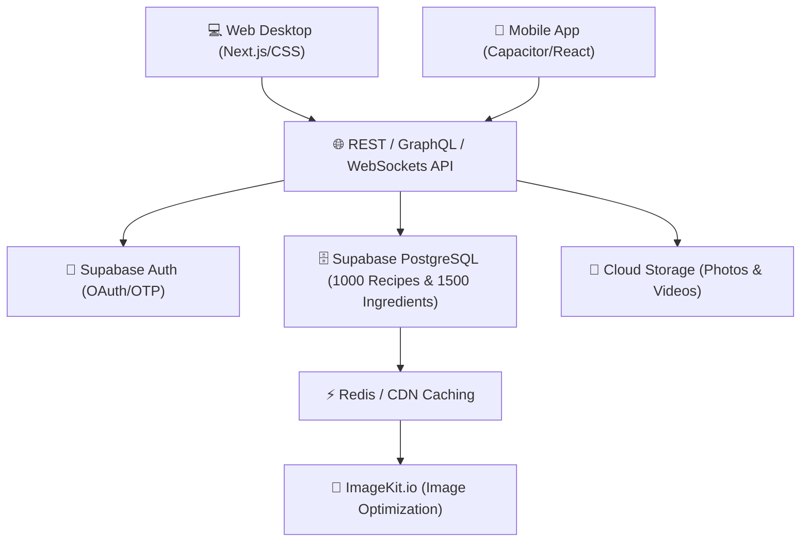

# 🍳 รายละเอียดและข้อเสนอแนะเพิ่มเติมสำหรับโครงการ N.Food (New Food)

เอกสารสเปกและแนวทางการพัฒนาโครงการ **N.Food** ฉบับปรับปรุงใหม่ โดยได้ปรับเปลี่ยนสไตล์การออกแบบของแอปพลิเคชันและเว็บไซต์ให้อยู่ในแนวทาง **"เรียบง่ายแต่หรูหรา (Minimalist Luxury / Quiet Luxury)"** และใช้ **"โทนสีธรรมชาติสบายตา (Relaxing & Organic Tones)"** เพื่อสร้างภาพลักษณ์ที่ดูอบอุ่น เป็นมิตรกับอาหาร และมีความพรีเมียมสูงสุด

---

## 🎨 โลโก้แบรนด์โครงการ (Project Logo Design)
เราได้ทำการออกแบบโลโก้ใหม่สำหรับ **N.Food** ให้สอดคล้องกับแนวทางความเรียบหรูและโทนสีที่สบายตา:
*   **ลิงก์ไฟล์ภาพโลโก้ใหม่:** [nfood_lux_logo.png](file:///c:/Users/User/Desktop/project%20%28%E0%B9%82%E0%B8%9B%E0%B8%A3%E0%B9%80%E0%B8%88%E0%B8%84%E0%B8%88%E0%B8%9A%29/website1/N.Food/nfood_lux_logo.png)
*   **รายละเอียดดีไซน์:** ออกแบบโดยเน้นความมินิมอล ใช้เส้นโครงร่างรูปหมวกเชฟสีทองแชมเปญ (Champagne Gold) ที่โค้งมนลื่นไหล ผสานกับสัญลักษณ์ใบไม้ออร์แกนิกสีเขียวเซจ (Sage Green) ลอยตัวอย่างประณีตบนพื้นหลังสีขาวลินิน (Linen White) ที่สะอาดตา ให้ความรู้สึกเรียบหรู อบอุ่น ผ่อนคลาย และเป็นธรรมชาติ

---

## 🎨 มาตรฐานการออกแบบร่วม (Gold & White Luxury Design System)
เพื่อตอบโจทย์ **"ทันสมัย สวยงาม อลังการและหรูหราอย่างมีระดับ"** เราจะใช้เกณฑ์ดีไซน์ดังต่อไปนี้:
*   **ความหรูหราอลังการและโปร่งใส (Grand Gold & White Glassmorphism UI):**
    *   **Gold-Trimmed Glassmorphism:** ส่วนที่แสดงผลเมนูอาหาร (Recipe Cards), แผงควบคุม, และปุ่มต่างๆ จะใช้กระจกโปร่งแสงกึ่งใสพิเศษ (Translucent Glassmorphism) พร้อมกรอบทองคำเมทัลลิกบางเบา (`rgba(212, 175, 55, 0.2)`) ลอยเด่นสวยงามบนพื้นหลังฝ้าเบลอ เพื่อสร้างเอฟเฟกต์สะท้อนที่ลึกและเรียบหรูขั้นสุด
    *   **Glassmorphic Sidebar:** แผงเมนูด้านซ้ายดีไซน์เป็นแผ่นกระจกรมดำโปร่งแสงลอยเด่น พร้อมเส้นแบ่งขอบสีทองคำแชมเปญบางเบา สร้างมิติการซ้อนทับที่โอ่อ่าหรูหรา
    *   **Fine Gold Lines & Majestic Glows:** ใช้เส้นขอบทองคำบางพิเศษ และเงาสะท้อนเรืองแสงโทนสีทองบางเบาที่นุ่มละมุนใต้แผงควบคุมหลัก
    *   **Elegant Typography & Text Gradients:** หัวข้อหลัก (H1) แสดงผลด้วยฟอนต์ไม่มีหัวขนาดใหญ่ไล่เฉดสีจากสีขาวไข่มุกไล่โทนไปสู่สีทองคำเมทัลลิกอย่างประณีต
    *   **Metallic Shine Hover Sweep:** ปุ่มกดมีแอนิเมชันเมื่อเมาส์ชี้ผ่าน (Hover) จะมีลำแสงสีขาวสีเงินวาดผ่านแผ่นทองคำ (Shine Sweep Effect) พร้อมตัวปุ่มลอยตัวขึ้นเพื่อประสบการณ์ใช้งานระดับพรีเมียม
*   **โทนสีทองและขาวสุดหรูหรา (Luxurious Gold & White Colors):**
    *   **Light Mode (หรูหรา สะอาดตา และสว่างไสว):**
        *   **สีพื้นหลังหลัก:** พื้นหลังไล่เฉดวงกลม (Radial Gradient) สีขาวมุกและสีครีมลินินหรูหรา (`#FFFFFF` ถึง `#F5F4F0`)
        *   **สีหลัก & สีเน้น:** สีทองคำแท้เมทัลลิกสุดหรูหรา (`#D4AF37`)
        *   **สีพื้นหลังการ์ดเมนู:** กระจกใสขาวกึ่งโปร่งแสง (`rgba(255, 255, 255, 0.45)`) พร้อม Backdrop Filter เบลอ
        *   **สีตัวอักษร:** สีดำชาร์โคลหรูหรา (`#1C1A17`) และสีทองหม่น (`#736E64`)
    *   **Dark Mode (ลุ่มลึก สง่างาม และพรีเมียมเข้มอลังการ):**
        *   **สีพื้นหลังหลัก:** พื้นหลังไล่เฉดวงกลมมืดลึกพิเศษ (Radial Gradient `#171B1d` ถึง `#0A0C0D`) ให้ความรู้สึกเหมือนอยู่ในแกลเลอรีจัดแสดงผลงานระดับไฮเอนด์
        *   **สีเน้นและตัวอักษร:** สีทองคำสว่าง (`#D4AF37`) ผสานกับสีทองคำแชมเปญพาสเทล (`#F3E5AB`) และสีครีมสว่างอบอุ่น (`#F5F2EB`) เพื่อคงความเรียบหรูและถนอมสายตาในที่มืด
*   **รูปภาพประกอบ (Appetizing & Natural):**
    *   รูปภาพอาหารทุกจานจะเน้นการจัดแสงธรรมชาติโทนอุ่น คลีน สะอาดตา เข้ากันได้ดีกับสีทองและสีขาวของหน้าเว็บ โดยปราศจากสีสันฉูดฉาดเกินจริง

---

### 1. ระบบสมาชิก เข้าสู่ระบบ และตั้งค่า (Auth, Profile & Settings System)

#### หน้าต่างเข้าสู่ระบบ & สมัครสมาชิก (Login & Register Modal)
* **หน้าเข้าสู่ระบบ (Login):**
  * ช่องกรอก: **อีเมล หรือ เบอร์โทรศัพท์** และ **รหัสผ่าน (Password)**
  * ปุ่มข้อความ: **"ลืมรหัสผ่าน?" (Forgot Password?)**
  * ปุ่มกด: **"เข้าสู่ระบบ"** | **"-- OR --"** | ปุ่ม: **"เข้าสู่ระบบด้วย Google"**
  * *UI/UX Idea:* แสดงแผงล็อกอินเป็นคาร์ดกระจกฝ้าโปร่งแสงลอยเด่นอยู่เหนือภาพถ่ายอาหารสไตล์มินิมอลออร์แกนิกที่มีแสงส่องผ่านอย่างอบอุ่น
* **หน้าสมัครใช้งาน (Register):**
  * ช่องกรอกครบเซ็ต: **อีเมล หรือ เบอร์โทรศัพท์**, **ชื่อที่แสดง (Display Name)**, **ชื่อ (First Name)**, **นามสกุล (Last Name)**, **อายุ (Age)**, **รหัสผ่าน**, **ยืนยันรหัสผ่าน**
  * ช่องติ๊กเลือก: **☑️ "Remember my Password"**
  * ปุ่มกด: **"สมัครใช้งาน"** | **"-- OR --"** | ปุ่ม: **"สมัครใช้งานด้วย Google"**

#### ระบบลืมรหัสผ่านและยืนยัน OTP (Forgot Password & OTP Flow)
* **ขั้นตอนที่ 1:** กรอก **อีเมล หรือ เบอร์โทรศัพท์** + ตัวเลือกการรับรหัส (OTP SMS/Email หรือ ลิงก์รีเซ็ต)
* **ขั้นตอนที่ 2:** หน้ากรอกรหัส **OTP 6 หลัก** พร้อมตัวนับถอยหลังส่งใหม่ (60 วินาที) ที่เป็นวงกลมเส้นบางเฉียบสีเขียวเซจหมุนลดเวลาลงอย่างนุ่มนวล
* **ขั้นตอนที่ 3:** หน้าตั้ง **รหัสผ่านใหม่ (New Password)** และยืนยันรหัสผ่าน พร้อม Password Strength Indicator ที่เป็นแถบสีโทนสีครีม-เขียว ค่อยๆ สว่างขึ้นตามความปลอดภัย
* รองรับการเชื่อมต่อฝั่ง Backend ด้วย **Supabase Auth API** (`resetPasswordForEmail`, `verifyOtp`, `updateUser`)

---

## 2. ความหลากหลายของเมนูอาหาร (ประเทศไทย & นานาชาติ)
> **เป้าหมายเดิม & ความต้องการเพิ่ม:** รวบรวมเมนูอาหารคาวและหวานที่มีความหลากหลายทั้งในประเทศไทยและนานาชาติอย่างครอบคลุม

### 💡 แนวทางการนำเสนอ (UI/UX Presentation)
*   **Minimalist Cuisine Carousel:** แถบสไลด์ไอคอนหมวดหมู่อาหารและธงชาติต่างๆ ที่เรียบง่าย มีสไตล์เว้นช่องว่างอย่างสะอาดตา เมื่อผู้ใช้โฮเวอร์ (Hover) ไอคอนจะขยายขนาดขึ้นเล็กน้อยพร้อมเอฟเฟกต์แสงไฮไลท์สีทองแชมเปญบางเบา
*   **Clean Cuisine Map:** แผนที่โลกจำลองในสไตล์ลายเส้นร่างมือมินิมอลผ่อนคลาย (Hand-drawn Sketch) ที่แสดงอาหารเด่นของแต่ละเขตพื้นที่ ช่วยให้การเลือกเมนูต่างชาติดูสนุกและสะอาดตา

### ✨ รายละเอียดฟีเจอร์เชิงลึก (Detailed Features)
*   **Cuisine Structure:**
    *   **อาหารไทยหลากหลายภูมิภาค:** คัดสรรสูตรอาหารท้องถิ่นยอดนิยมจากภาคกลาง, ภาคเหนือ, ภาคใต้ และภาคอีสาน รวมถึงเมนูอาหารไทยชาววังและสตรีทฟู้ด
    *   **อาหารนานาชาติสากล:** ครอบคลุมเมนูเด่นจากเอเชีย (ญี่ปุ่น, เกาหลี, จีน, อินเดีย), ยุโรปและตะวันตก (อิตาลี, ฝรั่งเศส, อเมริกา) และตะวันออกกลาง
*   **Lifestyle & Health Filtering:** ระบบคัดแยกเมนูเพื่อสุขภาพ เช่น คีโต (Keto), มังสวิรัติ (Vegetarian), วีแกน (Vegan), ปลอดกลูเตน (Gluten-Free) หรืออาหารปราศจากถั่วและนมสำหรับคนแพ้ง่าย

---

## 3. ข้อมูลวัตถุดิบและวิธีทำที่สมบูรณ์
> **เป้าหมายเดิม & ความต้องการเพิ่ม:** บอกข้อมูลวัตถุดิบ ปริมาณ สัดส่วน และอธิบายวิธีทำทุกขั้นตอนอย่างครบถ้วนและสมบูรณ์ในทุกเมนู

### 💡 แนวทางการนำเสนอ (UI/UX Presentation)
*   **Elegant Prep Checklists:** รายการวัตถุดิบพร้อมรูปประกอบไอคอนเรียบหรู เมื่อแตะเลือกขีดฆ่าวัดถุดิบที่เตรียมเสร็จแล้ว ตัวการ์ดจะจางลงเล็กน้อยอย่างมีระดับ
*   **Cooking Mode Layout (Cozy View):** หน้าจอเข้าครัวดีไซน์สบายตาตัวอักษรใหญ่ชัดเจนเพื่ออ่านในระยะห่างขณะทำอาหาร:
    *   **ฝั่งซ้าย:** รายการวัตถุดิบที่ต้องใช้เฉพาะในขั้นตอนนั้นๆ
    *   **ฝั่งขวา:** คำอธิบายและเทคนิควิธีทำ พร้อมวิดีโอวนซ้ำสั้นๆ คมชัดสูงที่เน้นการจัดแสงธรรมชาติโทนอุ่นสบายตา

### ✨ รายละเอียดฟีเจอร์เชิงลึก (Detailed Features)
*   **Soft Step Timers:** ปุ่มตั้งเวลาจับเวลารูปแบบวงแหวนมินิมอลที่จะส่งเสียงเตือนผ่อนคลาย (เช่น เสียงกริ่งแก้วใสหรือเสียงดนตรีแบบ Lo-fi อบอุ่น) เมื่ออาหารสุกดี
*   **Hands-Free Voice Assistant:** สั่งการเปลี่ยนขั้นตอนด้วยเสียงโดยไม่ต้องสัมผัสหน้าจอ เหมาะสำหรับเวลาที่มือเปื้อนวัตถุดิบ

---

## 4. ระบบค้นหาเมนูอาหารและวัตถุดิบ
> **เป้าหมายเดิม & ความต้องการเพิ่ม:** ค้นหาเมนูอาหารและวัตถุดิบต่างๆ ได้รวดเร็ว ตรงความต้องการและยืดหยุ่น

### 💡 แนวทางการนำเสนอ (UI/UX Presentation)
*   **Minimalist Omnibar Search:** แถบค้นหากลางหน้าจอแบบไร้ขอบสีทึบ ใช้ความโปร่งแสงของกระจกฝ้า แสดงผลลัพธ์ย่อยแบบทันใจพร้อมภาพอาหารสีละมุนตา
*   **"What's in my Fridge" Dashboard:** หน้าต่างจัดการตู้เย็นจำลองดีไซน์เรียบง่าย ผู้ใช้จิ้มเลือกวัตถุดิบที่มีอยู่ได้ง่ายๆ ระบบจะจับคู่ทำนายเมนูอาหารที่สามารถทำได้

### ✨ รายละเอียดฟีเจอร์เชิงลึก (Detailed Features)
*   **Match Scoring Engine:** แสดงสัญลักษณ์เปอร์เซ็นต์ความเข้ากันของเมนูตามวัตถุดิบที่มี พร้อมปุ่มสร้าง **Shopping List** สำหรับวัตถุดิบส่วนที่ขาดดึงเข้าตะกร้าอย่างรวดเร็ว
*   **Aesthetic Nutri-Filters:** ตัวกรองจำกัดพลังงานแคลอรีและสารอาหารให้อยู่ในเกณฑ์ที่ต้องการ

---

## 5. จำนวนเมนูและระบบคลังวัตถุดิบเริ่มต้น
> **เป้าหมายเดิม & ความต้องการเพิ่ม:** อาหารคาว 500 เมนู อาหารหวาน 500 เมนู (รวม 1,000 เมนู) และฐานข้อมูลคลังวัตถุดิบเริ่มต้นมากกว่า 1,500 ชนิด

### 💡 แนวทางการนำเสนอ (UI/UX Presentation)
*   **Aesthetic Catalog Grid:** การ์ดเมนูอาหาร 1,000 เมนู ที่จัดเรียงอย่างสมมาตรเรียบง่ายแบบไร้กรอบหนาตา (Borderless Grid Layout) โหลดหน้าเว็บเร็วด้วย Lazy Loading
*   **Ingredient Dictionary Wiki:** หน้ารวมวัตถุดิบมากกว่า 1,500 ชนิด ออกแบบเหมือนการ์ดข้อมูลสะสมสไตล์พฤกษศาสตร์โบราณที่ดูโมเดิร์นสะอาดตา บอกสรรพคุณและคุณค่าทางอาหารอย่างเป็นระบบ

### ✨ รายละเอียดฟีเจอร์เชิงลึก (Detailed Features)
*   **Relational Schema (Supabase Database):** โครงสร้างข้อมูล SQL ที่มีประสิทธิภาพสูง เชื่อมโยงสูตรอาหาร 1,000 เมนูกับฐานข้อมูลวัตถุดิบ 1,500+ ชนิด เพื่อการคำนวณและปรับเปลี่ยนสัดส่วนแคลอรีอย่างแม่นยำ

---

## 6. ระบบคำนวณแคลอรีและโภชนาการแบบ Real-time (1 - 1,000,000 จาน)
> **เป้าหมายเดิม & ความต้องการเพิ่ม:** คำนวณแคลอรีและส่วนผสมแบบเรียลไทม์ โดยปริมาณส่วนผสมและแคลอรีจะปรับขึ้นลงทันทีตามจำนวนเสิร์ฟ (1 ถึง 1,000,000 จาน)

### 💡 แนวทางการนำเสนอ (UI/UX Presentation)
*   **Minimalist Scale Controller:** ปุ่มเลื่อนสไลเดอร์และช่องกรอกตัวเลขดีไซน์เรียบหรู ตั้งแต่ 1 จาน ถึง 1,000,000 จาน 
*   **Rolling Numbers Animation:** ตัวเลขปริมาณวัตถุดิบและค่าโภชนาการจะวิ่งเปลี่ยนอย่างลื่นไหลเมื่อเลื่อนปรับสเกลจานอาหาร เพื่อให้รู้ว่าคำนวณแบบเรียลไทม์

### ✨ รายละเอียดฟีเจอร์เชิงลึก (Detailed Features)
*   **Client-Side Scale Engine:** ใช้สูตรคำนวณสเกลปริมาณวัตถุดิบและแคลอรีรวมบนเบราว์เซอร์ของผู้ใช้ทันทีโดยไม่ต้องรอดึงข้อมูลใหม่จากเซิร์ฟเวอร์
*   **ระบบหักลบคลังวัตถุดิบอัตโนมัติ (Inventory Auto-deduction):** เมื่อผู้ใช้กดปรุงอาหารตามจำนวนจาน ระบบจะไปหักวัตถุดิบที่มีอยู่ในสต็อกตู้เย็นเสมือนจริงให้ลดลงโดยอัตโนมัติ สะดวกสำหรับการใช้งานจัดการอาหารในชีวิตจริง

---

## 7. กิจกรรมวงล้อสุ่ม (สุ่มอาหาร & สุ่มวัตถุดิบ)
> **เป้าหมายเดิม & ความต้องการเพิ่ม:** 
> 1. หมุนวงล้อสุ่มอาหาร: แสดงภาพอาหารบนช่องวงล้อ มีปุ่มคัดกรองหมวดหมู่ที่อยากสุ่ม
> 2. หมุนวงล้อสุ่มวัตถุดิบ: สุ่มวัตถุดิบหาไอเดียในการทำอาหาร
> ดีไซน์เรียบง่ายแต่หรูหรา หมุนต่อได้เรื่อยๆ ไม่มีล็อกหน้าจอ และมีปุ่มยืนยันหรือยกเลิกการสุ่ม

### 💡 แนวทางการนำเสนอ (UI/UX Presentation)
*   **Grand Luxury Gold Wheel (460px):** วงล้อสุ่มอาหารได้รับการพัฒนาขยายขนาดใหญ่ขึ้นเป็นพิเศษเป็นเส้นผ่านศูนย์กลาง 460px เพื่อความอลังการและเห็นภาพอาหารเด่นชัด ขอบวงล้อประดับด้วยโลหะสีทองคำแท้แวววาว ภายในแบ่งเป็นช่องแฉกสีทองคำเมทัลลิกสลับกับสีขาว/สีมุกเข้มขลิบเส้นแบ่งสีทองบางเบา มีเข็มชี้สีทองคำนำโชคและปุ่มหมุนตรงกลางที่เป็นแป้นทองคำนูนเงาหรูหรา
*   **Elegant Winner Overlay:** เมื่อวงล้อหยุดการหมุน แผงคำตอบที่สุ่มได้จะแสดงผลแบบกระจกใส (Glassmorphism Overlay) ลอยลื่นไหลขึ้นมาอย่างสวยงาม มีภาพจานอาหารขนาดใหญ่ขอบมน พร้อมปุ่มกด **"ยืนยันเพื่อเข้าครัว"** สีเขียวสมุนไพรพรีเมียม และปุ่ม **"หมุนสุ่มต่อ"** ในโทนกระจกฝ้าครีมทองอ่อนโยน

### ✨ รายละเอียดฟีเจอร์เชิงลึก (Detailed Features)
*   **Pre-spin Filters:** ปุ่มเลือกกรองหมวดหมู่อาหารคาว/หวาน สัญชาติ หรือระดับแคลอรีอย่างง่ายที่ขอบวงล้อ
*   **Ingredient Combination Roulette:** สุ่มเลือกวัตถุดิบ 1-3 อย่างเพื่อหาแรงบันดาลใจในการรังสรรค์เมนูใหม่

---

## 8. กิจกรรมโซเชียลมีเดียและระบบแชร์สูตรอาหารโดยผู้ใช้งาน (UGC & Social)
> **เป้าหมายเดิม & ความต้องการเพิ่ม:** ผู้ใช้สามารถโพสต์สูตรอาหาร รูปภาพ และวิดีโอสั้นทำอาหารได้ มีระบบแจ้งเตือนไลก์/คอมเมนต์เรียลไทม์ และแชร์สูตรเชื่อมโยงไปยังโซเชียลมีเดียหลัก (Facebook, Instagram, TikTok, Twitter/X, Line) ได้อย่างสมบูรณ์

### 💡 แนวทางการนำเสนอ (UI/UX Presentation)
*   **Masonry Gallery Feed:** การจัดเรียงฟีดโพสต์จากทางบ้านแบบบอร์ดภาพศิลป์ (คล้าย Pinterest) แสดงผลวิดีโอทำอาหารสั้นและภาพจานสวยๆ จากผู้ใช้ทั่วโลกได้อย่างสะอาดตา
*   **Soft Notification Panel:** แผงระบบแจ้งเตือนแบบเรียลไทม์ (Real-time push) ที่โผล่ขึ้นมาอย่างเงียบเชียบและนุ่มนวล ไม่เด้งขัดจังหวะการอ่านสูตรอาหารของผู้ใช้

### ✨ รายละเอียดฟีเจอร์เชิงลึก (Detailed Features)
*   **Integrated Multi-platform Sharing:** ปุ่มแชร์ด่วนที่สร้างรูปภาพหน้าปกสูตรอาหารสไตล์การ์ดภาพถ่ายคลาสสิกสวยๆ พร้อม QR Code ไปยังโซเชียลมีเดียต่างๆ เช่น Line, Facebook, IG Stories ได้ทันทีในแตะเดียว

---

## 9. การรองรับหน้าจอและการแยกเวอร์ชัน (Responsive Layout & Persistent State)
> **เป้าหมายเดิม & ความต้องการเพิ่ม:** รองรับหน้าจอทุกขนาด แยกระหว่างเวอร์ชันคอมพิวเตอร์และมือถืออย่างชัดเจน หน้าตาสวยงามสอดคล้องกันและจดจำสถานะการใช้งานล่าสุด

### 💡 แนวทางการนำเสนอ (UI/UX Presentation)
*   **Mobile Bottom Bar Navigation:** แถบนำทางด้านล่างของมือถือที่เป็นแผงโปร่งแสงสีครีมอุ่น ให้ความรู้สึกเหมือนกำลังใช้งานแอปพลิเคชันดั้งเดิม
*   **Desktop Spacious Layout:** การใช้ประโยชน์จากหน้าจอกว้างด้วย Grid 3 คอลัมน์ที่สวยงาม แถบเมนูด้านซ้ายสีเบจละมุนตา

### ✨ รายละเอียดฟีเจอร์เชิงลึก (Detailed Features)
*   **Session State Autosave:** ระบบบันทึกขั้นตอนการทำอาหารล่าสุดและสเกลน้ำหนักวัตถุดิบอัตโนมัติลงในหน่วยความจำของเครื่องเบราว์เซอร์ เพื่อความสะดวกในการใช้งานอย่างต่อเนื่อง

---

## 10. เทคโนโลยีที่เหมาะสมและการพัฒนาจริง (Tech Stack & App Platform)
> **เป้าหมายเดิม & ความต้องการเพิ่ม:** สร้างเว็บไซต์และแอปพลิเคชันที่ใช้งานได้จริงในชีวิตประจำวัน โดยรักษาระบบและโครงสร้างการทำงานให้เหมือนกันทุกประการ

### ⚙️ สถาปัตยกรรมระบบที่แนะนำ (System Architecture)

### 💡 รายละเอียดทางเทคนิคของแต่ละส่วน (Technical Details)
*   **Frontend Web App (Next.js / React.js):** ใช้สำหรับพัฒนาหน้าตาเว็บไซต์ให้โหลดเร็ว ปรับแต่งสไตล์สไตล์เรียบหรูด้วย CSS Modules หรือ TailwindCSS ที่คุมโทนสีเขียวเซจ-ครีม-ทอง
*   **Hybrid Mobile App Converter (Capacitor.js):** ใช้เพื่อ Wrap เว็บไซต์สไตล์ Responsive ของเราเป็นแอปพลิเคชันดั้งเดิม (Native App) สำหรับติดตั้งบนมือถือ ทำให้ระบบการทำงานเหมือนกันทุกประการและอัปเดตเวอร์ชันได้ง่ายพร้อมๆ กัน
*   **Backend & DB (Supabase / PostgreSQL):** จัดการสิทธิ์ผู้ใช้งาน (Login/OTP), เก็บสูตร 1,000 เมนู วัตถุดิบ 1,500+ ชิ้น, และส่งแจ้งเตือนการไลก์/คอมเมนต์คอมมูนิตี้แบบสดๆ
*   **CDN Optimization (ImageKit.io / Cloudinary):** ประมวลผลย่อและแต่งแสงของรูปภาพและคลิปวิดีโอจากผู้ใช้โดยอัตโนมัติ เพื่อให้หน้าฟีดโหลดอย่างรวดเร็วเป็นพิเศษ
