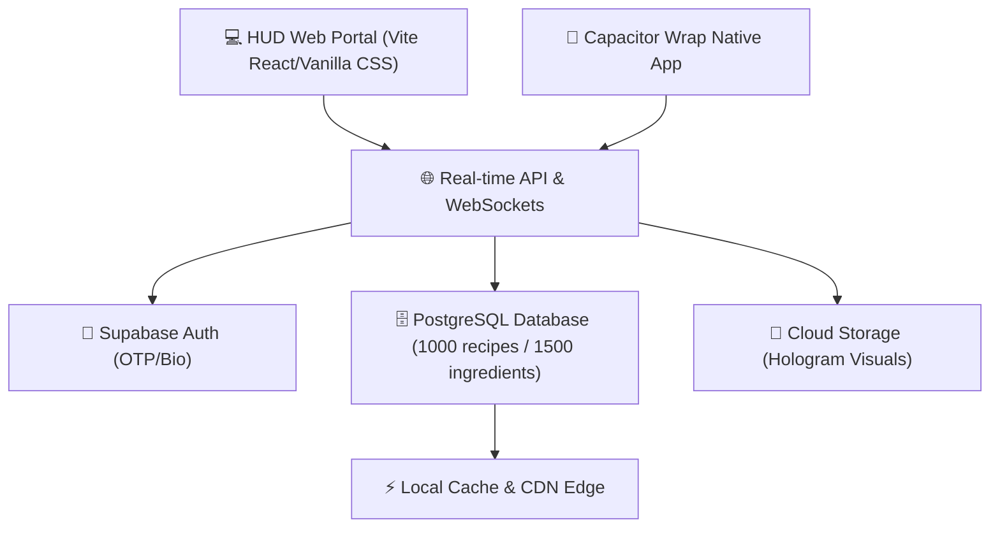

# 🍳 รายละเอียดและข้อเสนอแนะเพิ่มเติมสำหรับโครงการ N.Food (New Food) - Futuristic Sci-Fi Version

เอกสารสเปกและแนวทางการพัฒนาโครงการ **N.Food** ฉบับปรับปรุงใหม่ โดยได้ปรับเปลี่ยนสไตล์การออกแบบของแอปพลิเคชันและเว็บไซต์ให้อยู่ในแนวทาง **"เทคโนโลยีแห่งอนาคตสุดล้ำ (Futuristic Sci-Fi HUD / Cyberpunk Design)"** และใช้ **"โทนสีเข้มเน้นนีออนเรืองแสง (Dark Mode & Cyber Tones)"** เพื่อสร้างภาพลักษณ์ที่ดูล้ำยุค น่าตื่นเต้น และยกระดับประสบการณ์ใช้งานระบบประมวลผลอาหารและคำนวณโภชนาการแบบขีดสุด

---

## 🎨 ระบบการดีไซน์แห่งอนาคต (Futuristic Cyber-Food Design System)
เพื่อตอบโจทย์ **"ล้ำสมัย แปลกใหม่ อลังการ และเสมือนจริงราวกับแผงควบคุมในยานอวกาศ"** เราจะใช้เกณฑ์ดีไซน์ดังต่อไปนี้:

### 🌌 1. ธีมสีและแสง (Color Palette & Lighting)
*   **พื้นหลังสีเข้ม (Dark Mode First):** 
    *   ใช้สีพื้นหลังหลักเป็นสีดำสนิทห้องแล็บ (`#05070A`) และสีเทาเข้มคาร์บอนมืดลึก (`#0D1117`) เพื่อให้องค์ประกอบและข้อมูลเรืองแสงลอยเด่นขึ้นมา
*   **สีสะท้อนแสง (Neon & Fluorescent Accents):**
    *   **สีหลัก (Primary Neon):** สีเขียวสะท้อนแสงไซเบอร์ (`#39FF14` / Cyber Lime) สำหรับข้อมูลโภชนาการที่ปลอดภัยและสแกนผ่าน
    *   **สีรอง (Secondary Neon):** สีฟ้าไซแอนไฟฟ้า (`#00F0FF` / Electric Cyan) สำหรับขอบการ์ด เส้นสาย และหัวข้อหลัก
    *   **สีเน้น/แจ้งเตือน (Warning Accent):** สีชมพูฟิวเชียเรืองแสง (`#FF007F` / Neon Pink) สำหรับปุ่มออกจากระบบ แจ้งเตือน หรือข้อผิดพลาด
*   **เอฟเฟกต์เรืองแสง (Hologram Glow Effects):**
    *   ใส่ `box-shadow` หรือ `text-shadow` แบบนีออนจางๆ ให้กับปุ่ม คอนเทนเนอร์ หรือตัวหนังสือสำคัญ เพื่อเลียนแบบการแสดงผลของหน้าจอโฮโลแกรมสามมิติ

### 📐 2. การจัดเลย์เอาต์และรูปทรง (Geometric & Modular Layout)
*   **รูปทรงเหลี่ยมและเส้นกรอบเทค (Sci-Fi Beveled Borders):**
    *   หลีกเลี่ยงกล่องสี่เหลี่ยมโค้งมนแบบเดิม โดยการใช้เทคนิค `clip-path` เพื่อตัดมุมการ์ดและปุ่มเป็นเฉียง (Beveled Corners)
    *   เพิ่มเส้นกรอบบางพิเศษ 1px โทนสีสะท้อนแสง พร้อมสัญลักษณ์วงแหวนตรวจจับหรือฉากมุม (HUD corner brackets) เสมือนหน้าจอคอมพิวเตอร์อัจฉริยะ
*   **ตารางแบบโมดูลาร์ (Asymmetric Grid):**
    *   จัดวางภาพอาหารแบบเยื้องเหลื่อมล้ำและไม่สมมาตร (Borderless Asymmetric Layout) เพื่อส่งเสริมความรู้สึกเคลื่อนไหวและล้ำสมัย
*   **พื้นหลังกระจกอัจฉริยะ (Cyber Glassmorphism):**
    *   ใช้หน้าต่างและแผงควบคุมกึ่งใสพิเศษ (`background: rgba(13, 17, 23, 0.7)`) ผสานกับการเบลอพื้นหลังระดับสูง (`backdrop-filter: blur(15px)`) พร้อมเส้นแบ่งขอบสีฟ้าไซแอนเรืองแสงบางเบา

### 🔤 3. แบบอักษรแห่งอนาคต (Futuristic Typography)
*   **ฟอนต์แนวเทคโนโลยี (Tech & Sans-Serif Fonts):**
    *   หัวข้อหลัก ปุ่ม และข้อมูลตัวเลขขนาดใหญ่ใช้ฟอนต์ **Orbitron** หรือ **Rajdhani** จาก Google Fonts เพื่อเน้นโครงสร้างเหลี่ยมเทคโนโลยี
    *   ข้อความข้อมูลหลักและคำอธิบายใช้ **Space Grotesk** หรือ **Share Tech Mono** ที่อ่านง่ายและให้อารมณ์โค้ดโปรแกรมเมอร์
*   **แอนิเมชันพิมพ์ข้อความและ Glitch (Text FX):**
    *   แอนิเมชันตัวหนังสือสั่นไหวสไตล์ภาพแทรกแซงชั่วขณะ (Glitch Effect) สั้นๆ เมื่อนำเมาส์ไปชี้ที่โลโก้หรือหัวข้อหลัก
    *   ตัวหนังสือแนะนำสูตรอาหารประจำวันจะพิมพ์ตัวเองขึ้นมาเรื่อยๆ ทีละอักษร (Typewriter Effect) พร้อมเคอร์เซอร์กระพริบเมื่อเปิดหน้าเว็บ

### 🍔 4. การนำเสนออาหารและโภชนาการ (Futuristic Food Concept)
*   **ภาพอาหารสไตล์ห้องทดลอง (Lab & Molecular Gastronomy Visuals):**
    *   รูปภาพอาหารจะเน้นความคมชัดแบบไฮเอนด์ จัดแสงสตูดิโอคู่โทนสีนีออน (เช่น ม่วง-ฟ้า) หรือใช้ภาพจานที่มีควันไนโตรเจน ควันโฮโลแกรมลอยฟุ้ง หรือสไตล์อาหารแนวเคมีฟิสิกส์โมเลกุล
*   **ข้อมูลโภชนาการแบบ HUD Scan (Radar Scan Overlay):**
    *   แทนที่จะแสดงราคาและปริมาณเป็นตารางธรรมดา ระบบจะจำลองตัวสแกนวิเคราะห์สารอาหารและแคลอรี โดยแสดงผลเป็นกราฟใยแมงมุม (Radar Chart) สีเขียวนีออนกระพริบแบบ Real-time ทันทีที่เลือกปริมาณจานเสิร์ฟ

### ⚡ 5. ปฏิสัมพันธ์และแอนิเมชัน (Interactivity & Micro-interactions)
*   **เส้นแสงนีออนวิ่งรอบการ์ด (Animated Border Glow):**
    *   เมื่อวางเมาส์เหนือการ์ดเมนูอาหาร จะมีลำแสงนีออนวิ่งวนรอบกรอบตัดมุมของการ์ด เพื่อนำสายตาผู้ใช้
*   **เสียงประกอบกลไกไซไฟ (UI Sound Effects):**
    *   เสียงสวิตช์กลไกเบาๆ เมื่อคลิกปุ่ม และเสียงสแกนตรวจจับข้อมูลแบบคอมพิวเตอร์เมื่อเลื่อนแถบสเกลวัตถุดิบ (มีสวิตช์ปิด/เปิดเสียงประกอบได้ที่แถบตั้งค่า)
*   **เป้าเล็งเป้าแสง (Custom Tech Cursor):**
    *   ลูกศรเมาส์เปลี่ยนเป็นเป้าเล็งโฮโลแกรมวงแหวนสีฟ้า ซึ่งจะหดตัว ขยายตัว หรือเปลี่ยนเป็นวงแหวนสแกนตรวจจับเมื่อชี้โดนปุ่มกดหรือวัตถุดิบ

---

## ⚙️ รายละเอียดฟีเจอร์ระบบสไตล์ไซไฟ (Futuristic System Specifications)

### 1. ระบบสมาชิกและแผงควบคุมโฮโลแกรม (Auth, Profile & Settings System)
*   **หน้าต่างล็อกอิน & สมัครใช้งาน (HUD Access Terminal):**
    *   แสดงผลการล็อกอินเป็นกรอบแก้วใสเฉือนมุมมีแถบประเมินการเข้าสู่ระบบแบบเปอร์เซ็นต์โหลด
    *   รองรับช่องกรอก **อีเมล หรือ เบอร์โทรศัพท์** และ **รหัสผ่าน (Password)** พร้อมปุ่มสแกนลายนิ้วมือ/ใบหน้าจำลองเพื่อความล้ำยุค
    *   สำหรับระบบสมัครใช้งาน จะมีช่องกรอกประวัติครบชุด และแถบวัดระดับความปลอดภัยรหัสผ่านที่เปลี่ยนสีจากชมพูเรืองแสงไปหาเขียวนีออนเข้ม (Security Strength Level Indicator)
*   **ระบบ OTP และลืมรหัสผ่าน (Verification Portal):**
    *   การตรวจสอบรหัส OTP 6 หลักมาพร้อมการแสดงผลวงแหวนนับเวลาถอยหลัง 60 วินาทีแบบลายเส้นเรดาร์หมุนวน
    *   เชื่อมต่อความลื่นไหลด้วย **Supabase Auth API** เพื่อบันทึกข้อมูลแบบเรียลไทม์

### 2. แผนผังเมนูอาหารอนาคตหลากหลายสัญชาติ (Futuristic World Cuisine Map)
*   **Cyberpunk Cuisine Carousel:** สไลด์เมนูอาหารคาวและหวานที่มีสัญลักษณ์ไอคอนนีออนแบ่งตามประเทศและภูมิภาค
*   **Holo-Globe Mapping:** แผนที่โลกโฮโลแกรมจำลอง 3D เสมือนแผ่นดินสีน้ำเงินเรืองแสงลอยอยู่ ผู้ใช้งานคลิกเลือกประเทศเพื่อสแกนสูตรอาหารประจำชาตินั้นๆ ขึ้นมาบนจอหลัก
*   **Lifestyle Filter Scan:** คัดกรองเมนูสุขภาพ (Keto, Vegan,มังสวิรัติ, คลีน) ในรูปแบบข้อมูลสัญลักษณ์เซ็นเซอร์อาหาร

### 3. รายการวัตถุดิบและระบบช่วยทำอาหารอัจฉริยะ (Smart Prep & Assist Cooking Mode)
*   **Quantum Prep Checklists:** ตารางวัตถุดิบที่จะจางหายไปเป็นละอองแสงโฮโลแกรมเมื่อติ๊กเลือกเตรียมวัตถุดิบชิ้นนั้นๆ สำเร็จ
*   **Sci-Fi Cooking Dashboard (HUD cooking):**
    *   เมื่อเข้าสู่โหมดทำอาหาร หน้าจอจะปรับเป็นโหมดมุมกว้างสไตล์แผงควบคุมยานอวกาศ (HUD Fullscreen):
    *   **ฝั่งซ้าย:** แสดงปริมาณวัตถุดิบเฉพาะขั้นตอนนั้นๆ พร้อมกราฟแถบพลังงานความร้อนสะสม
    *   **ฝั่งขวา:** แอนิเมชันขั้นตอนการเตรียมอาหาร และ ** soft timer** ที่จับเวลาแบบเรดาร์วงแหวนพร้อมเสียงสัญญาณเตือนเตือนแบบคลื่นเสียงพลังงานนุ่มนวล
    *   **Hands-Free Voice Command:** สั่งงานเลื่อนขั้นตอนถัดไป/ย้อนกลับด้วยเสียงพูดโดยระบุคำสั่งเสียง เช่น *"N.Food, Next"* หรือ *"N.Food, Back"* เพื่อความสะดวกขณะทำอาหาร

### 4. ระบบการค้นหาและโมดูลสแกนตู้เย็น (Aesthetic Search & Fridge scanner)
*   **Nebula Omnibar Search:** ช่องสแกนสูตรอาหารอัจฉริยะ ค้นหาวัตถุดิบและสูตรได้อย่างแม่นยำ พร้อมการทำนายคำค้นหาอัตโนมัติ (AI autocomplete simulation)
*   **"Fridge Bio-Scanner" Dashboard:**
    *   ผู้ใช้สามารถเลือกป้อนวัตถุดิบที่คงเหลืออยู่ในตู้เย็นเข้าสู่ตู้เย็นเสมือนจริง
    *   ระบบประมวลผลด้วย **Match Scoring Engine** เพื่อคำนวณสูตรอาหารที่ทำได้ทันทีโดยระบุเป็นร้อยละความน่าจะเป็นของความสมบูรณ์ในการทำเมนู พร้อมสร้าง **Shopping Cart List** อัตโนมัติสำหรับวัตถุดิบที่ต้องสั่งเพิ่มเพื่อทำเมนูนั้นๆ

### 5. ขนาดฐานข้อมูลคลังอาหารและวัตถุดิบเริ่มต้น
*   **Aesthetic Catalog Grid:** จัดเก็บเมนูอาหารคาว 500 เมนู และอาหารหวาน 500 เมนู (รวม 1,000 เมนู) บนตาราง Modular ไร้กรอบ
*   **Ingredient Dictionary Wiki:** รวบรวมวัตถุดิบมากกว่า 1,500 ชนิดที่แสดงประวัติ รายละเอียดทางโภชนาการ สรรพคุณทางยา และสารอาหารที่ร่างกายได้รับราวกับประวัติศาสตร์สารานุกรมวิทยศาสตร์อาหาร
*   **Database Schema:** โครงสร้างข้อมูล SQL บนระบบ **Supabase PostgreSQL** เชื่อมโยงรหัสวัตถุดิบกับรายการเมนูอย่างเป็นระบบ เพื่อให้คำนวณและปรับเปลี่ยนสเกลโภชนาการแบบไดนามิกได้ทันที

### 6. ระบบคำนวณโภชนาการแบบ Real-time (1 - 1,000,000 จาน)
*   **Futuristic Scale Slider:** แถบสไลด์ควบคุมปริมาณสเกลจานอาหารขอบเรืองแสง รองรับการป้อนปริมาณจานทำอาหารได้ตั้งแต่ 1 จาน ไปจนถึง 1,000,000 จาน
*   **Cyber Numeric Rolling Effect:** ตัวเลขแคลอรี น้ำหนัก และสารอาหารจะหมุนสลับเปลี่ยนอย่างรวดเร็ว (Rolling Counter Effect) สอดคล้องกับการเลื่อนปรับน้ำหนักและจำนวนจานแบบเสี้ยววินาที
*   **Inventory Auto-deduction:** หากกดปรุงอาหารตามสูตร ระบบจะคำนวณปริมาณวัตถุดิบที่ต้องใช้อัตโนมัติและส่งคำสั่งลดยอดจำนวนวัตถุดิบคงคลังในตู้เย็นจำลอง (Virtual Fridge Stock) ทันที

### 7. วงล้อระบบสุ่มอาหารและวัตถุดิบ (Holo-Roulette Activity)
*   **Cybernetic Scan Wheel (460px):**
    *   อัปเกรดวงล้อสุ่มอาหารเป็นวงล้อวงแหวนแสงนีออนโฮโลแกรม (Holographic HUD Roulette) เส้นผ่านศูนย์กลาง 460px 
    *   ขอบนอกเรืองแสงและหมุนวนตามแนวเข็มนาฬิกาอย่างรวดเร็วพร้อมคลื่นเสียงความถี่ไซไฟ ช่องวงล้อสลับเฉดสีฟ้านีออนและเขียวนีออนพร้อมรูปเมนูอาหารเรืองแสงบางเบา
    *   **Winner Overlay:** เมื่อผลลัพธ์หยุดหมุน จะมีแถบการ์ดแสดงผลสแกนเมนูนั้นๆ ลอยขึ้นมาแบบ Glassmorphism พร้อมเสียงเอฟเฟกต์ "Success Ping" และปุ่มเลือกยืนยันการทำเมนูหรือกดหมุนลุ้นใหม่ได้ไม่จำกัด

### 8. โซเชียลฟีดและการส่งผ่านแชร์สูตร (UGC Social Terminal)
*   **Grid Social Feed:** หน้าการแสดงผลโพสต์ วิดีโอทำอาหารสั้น และคอมมูนิตี้แบบบอร์ดกระจกโปร่งใสเลื่อนได้ไม่มีที่สิ้นสุด
*   **Quantum Share Port:** เมื่อผู้ใช้ต้องการแชร์สูตรอาหาร ระบบจะประมวลผลสร้าง "ภาพการ์ดโฮโลแกรมสูตรอาหารพร้อม QR Code ด่วน" นำออกเป็นรูปภาพสำหรับโพสต์ลงบน Line, Facebook หรือ TikTok ได้ทันทีเพียงคลิกเดียว
*   **Soft Notification HUD:** เมนูแจ้งเตือนระบบสัมผัสมุมขอบจอที่มีเอฟเฟกต์ไฟกระพริบแจ้งเตือนเงียบสงบเมื่อได้รับคอมเมนต์หรือการกดใจสูตรอาหาร

### 9. การทำงานข้ามระบบและการบันทึกค่าระบบจำลอง (Cross-platform Responsive & Cache)
*   **Adaptive HUD Design:** ปรับแต่งอินเทอร์เฟซยืดหยุ่นเข้ากับทุกขนาดหน้าจอ โดยเวอร์ชันคอมพิวเตอร์จะจำลองเหมือนจอมอนิเตอร์ศูนย์ควบคุมอาหารขนาดกว้าง และเวอร์ชันมือถือจะเปลี่ยนเป็นแถบเมนูควบคุมที่ด้านล่างสไตล์กระจกเงา
*   **Local State Cache:** หน้าจอบันทึกขั้นตอนทำอาหารล่าสุดและสเกลวัตถุดิบถูกเก็บใน localStorage เพื่อให้ผู้ใช้กลับมาทำต่อได้ทันทีหากเปิดเว็บอีกครั้งในภายหลัง

### 10. สถาปัตยกรรมระบบขั้นสุด (Tech Stack & Architecture)

---

## 🎨 ทิศทาง "โลกอนาคต" ที่เลือกใช้สำหรับระบบ N.Food
จากการปรับเปลี่ยนสไตล์ ธีมใหม่ของแอปพลิเคชันจะผสานลักษณะเด่นเพื่อประสบการณ์ที่ดีที่สุด ดังนี้:
*   **แนวคิดนำ (Hologram / Dashboard):** หน้าจอจำลองแผงควบคุมโปร่งแสง มีกราฟวิเคราะห์ ข้อมูลการสแกน สารอาหาร และเส้นสายวงแหวนสีฟ้าไฟฟ้า (`Electric Cyan`) เป็นหลัก
*   **องค์ประกอบเสริม (Cyberpunk / Neon Night):** ใช้สีเขียวสะท้อนแสง (`Cyber Lime`) และสีชมพูนีออน (`Neon Pink`) เป็นไฮไลต์จุดสำคัญบนพื้นหลังสีดำทึบห้องปฏิบัติการ เพื่อสร้างจุดนำสายตาและเพิ่มความพรีเมียมล้ำสมัยอย่างสมบูรณ์แบบ