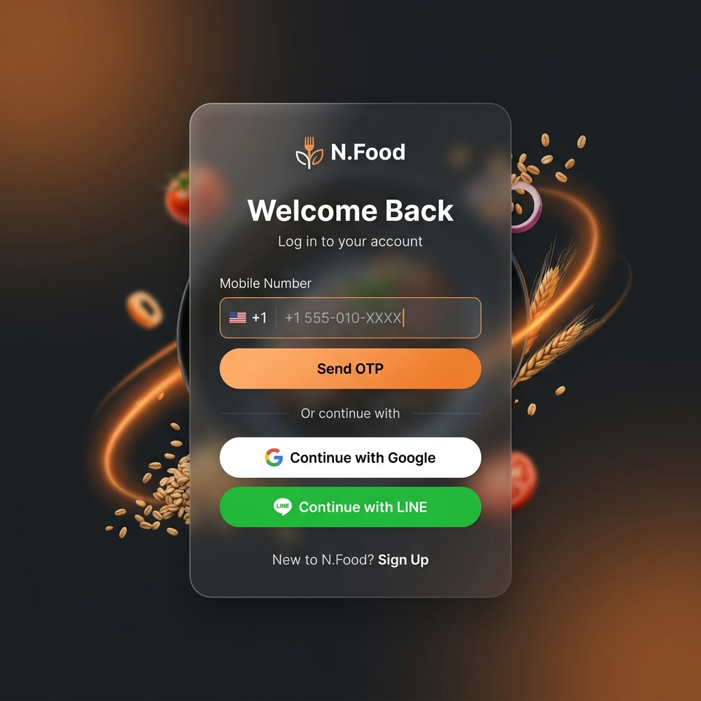
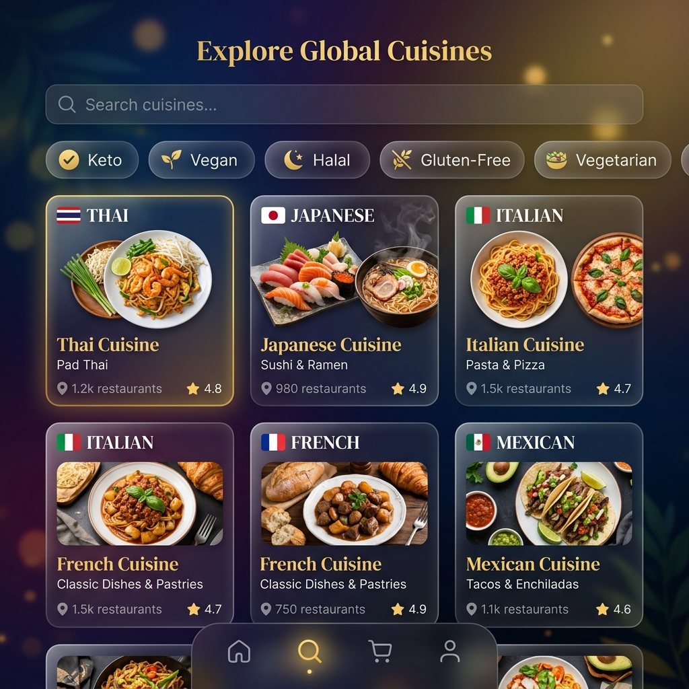
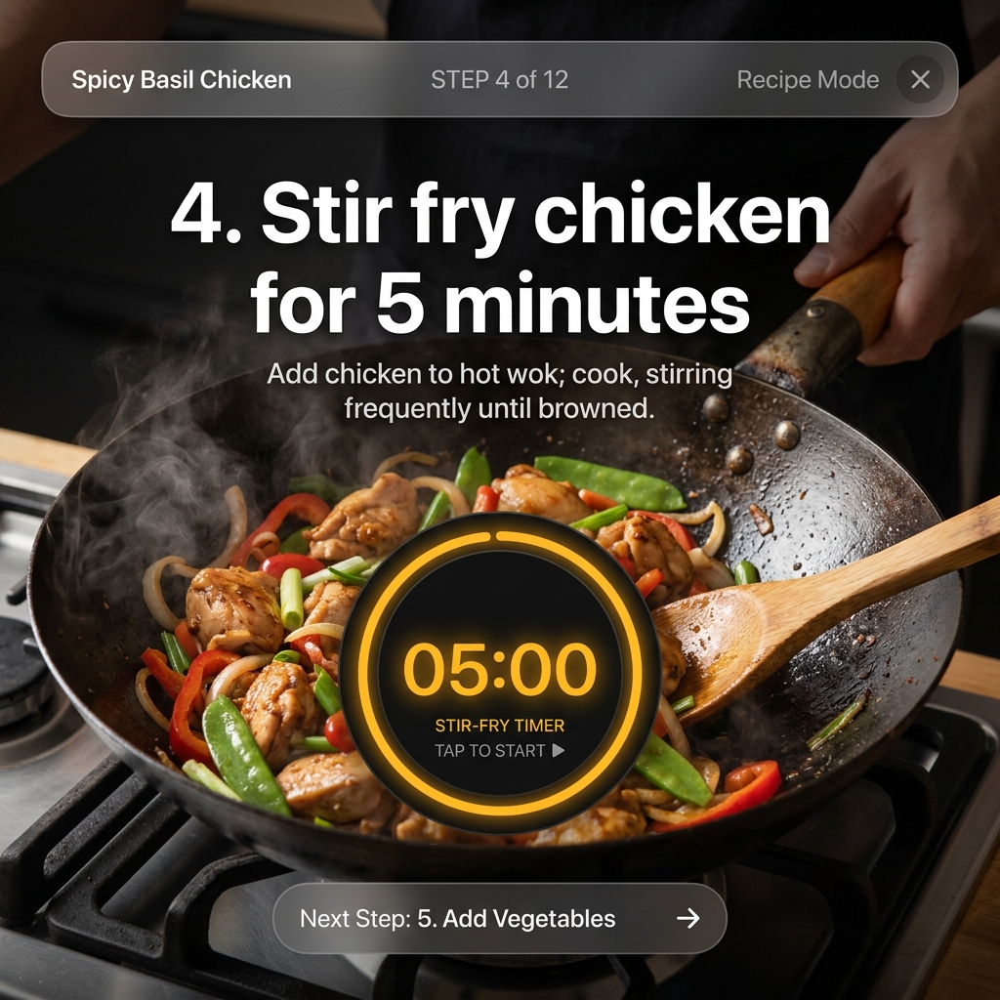
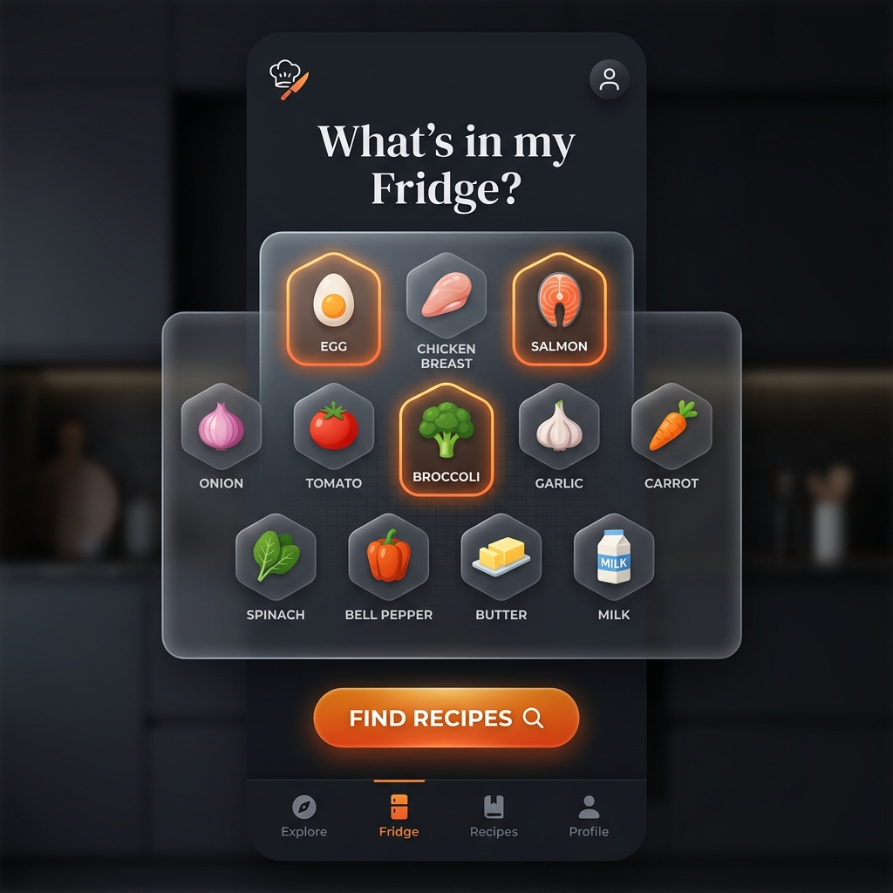
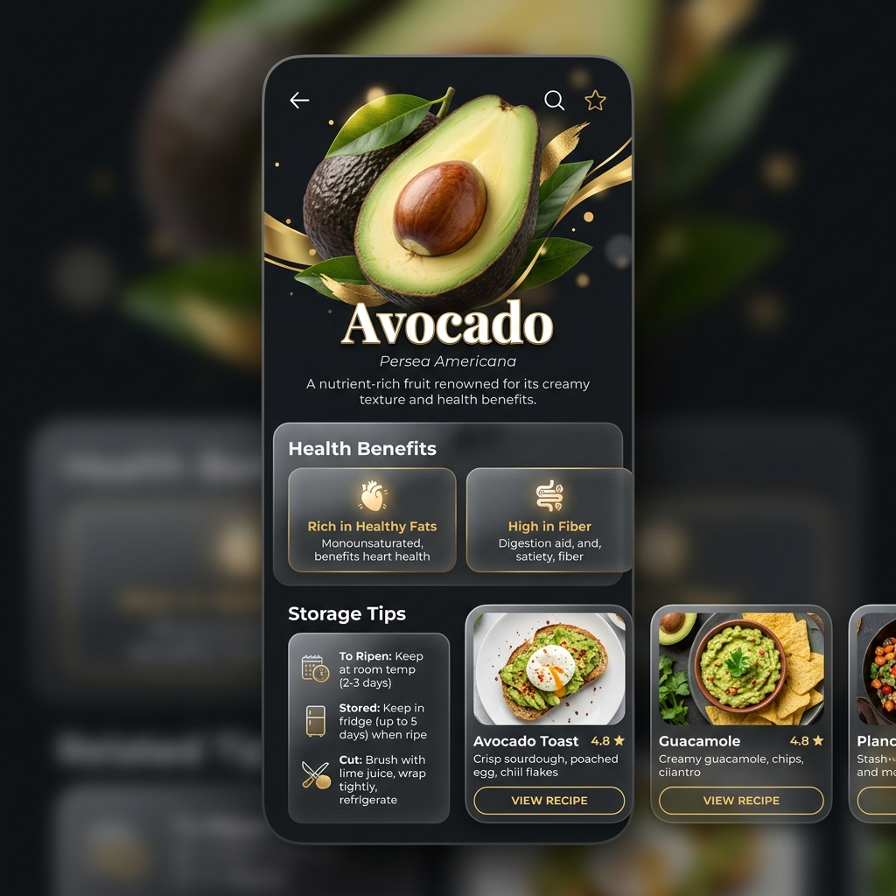
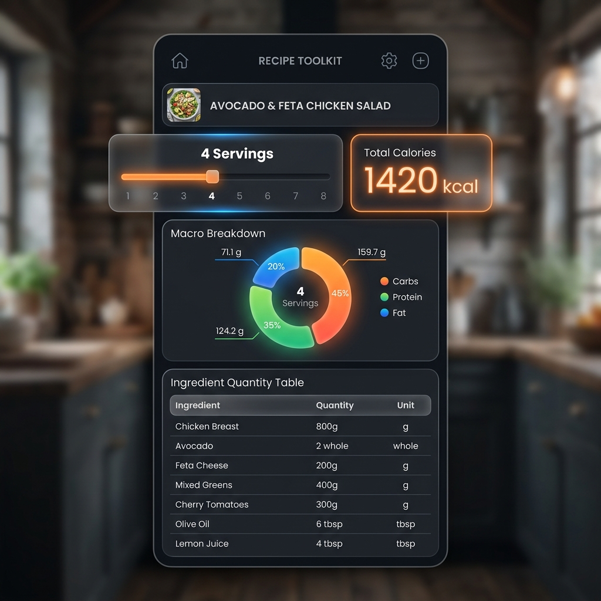
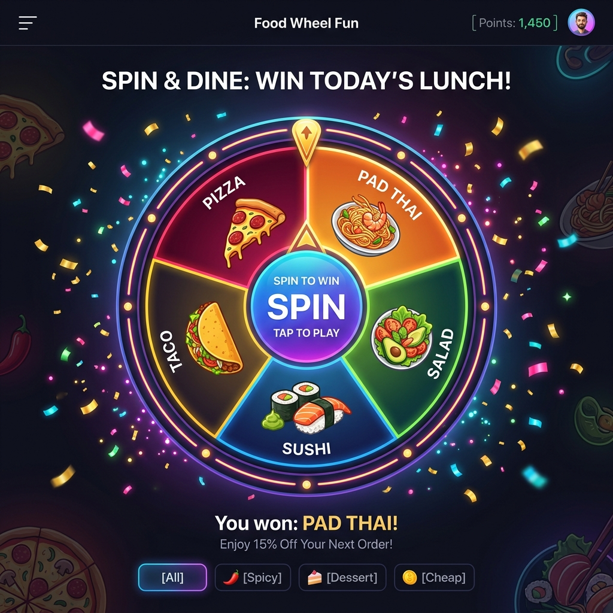
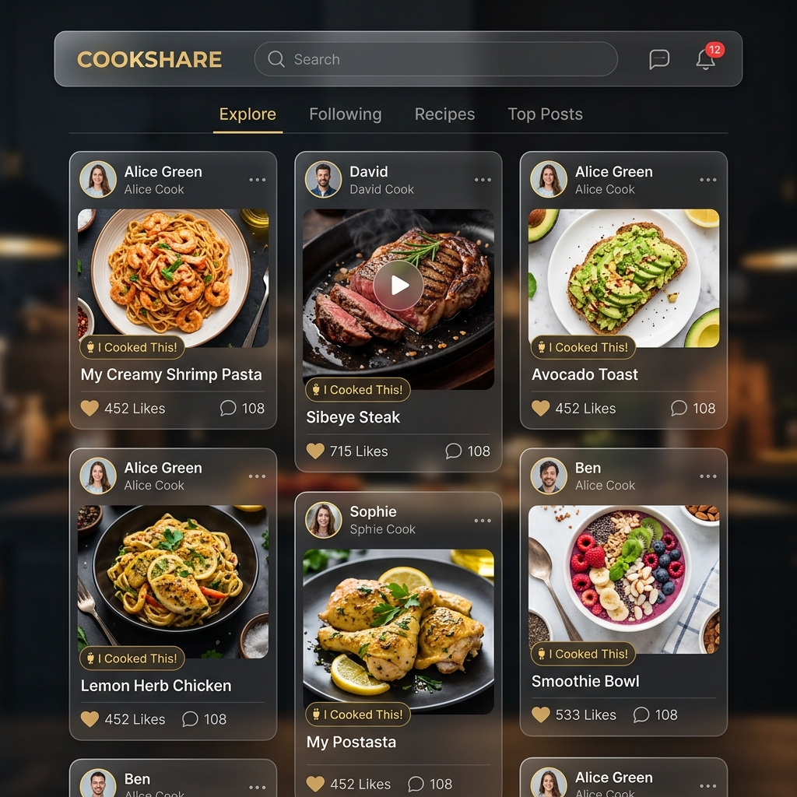
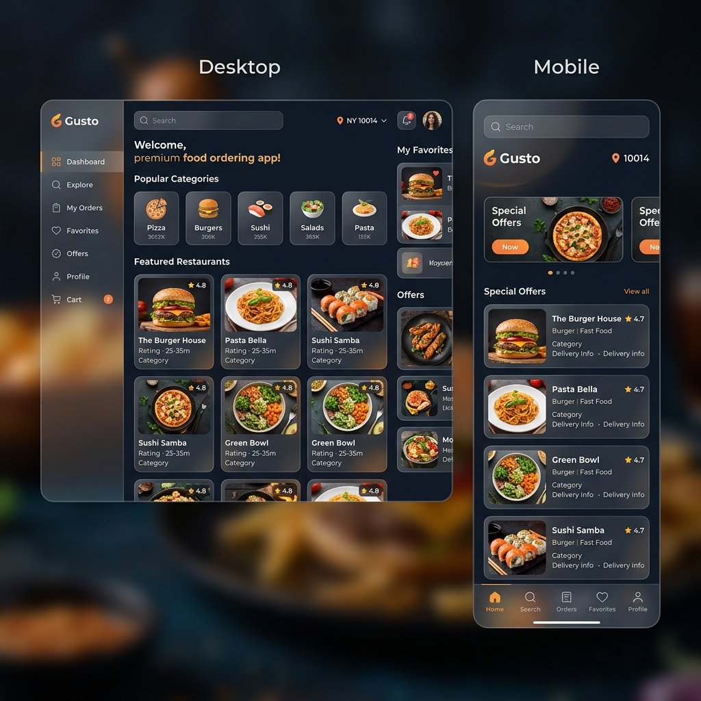
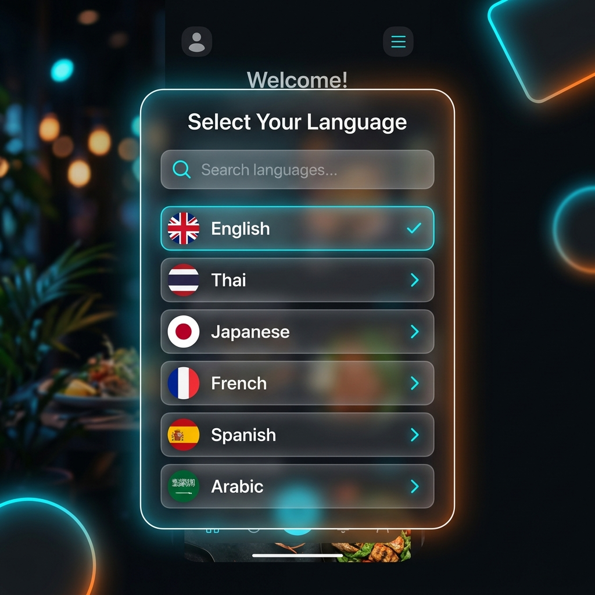

# แผนการวิเคราะห์รายละเอียดและข้อเสนอแนะเพิ่มเติมสำหรับเว็บไซต์ N.Food

เอกสารฉบับนี้เป็นการลงรายละเอียดในแต่ละหัวข้อของความต้องการเดิม เพื่อนำเสนอแนวทางการนำไปใช้งานจริง (Real-world Implementation) และเพิ่มลูกเล่น (Feature) ที่น่าสนใจเพื่อให้ระบบมีความพรีเมียม ตอบโจทย์ผู้ใช้งานจริง และพร้อมสำหรับการพัฒนาเป็นทั้งเว็บแอปพลิเคชันและโมบายแอปพลิเคชัน

---

## 1. ระบบการเข้าสู่ระบบและการสมัครสมาชิก (Authentication & Sign Up)
> **ความต้องการเดิม:** ล็อคอินผ่าน Facebook, Google, Gmail, Line, เบอร์โทรศัพท์ ส่งผ่าน OTP และเพิ่มระบบลงทะเบียนสมาชิกใหม่ในครั้งแรก เพื่อให้ครั้งถัดไปสามารถเข้าสู่ระบบจากฐานข้อมูลเดิมได้ทันที

### 💡 แนวทางการนำเสนอและแนวคิดการออกแบบ (UI/UX & Flow)
* **โมดอลสลับหน้าจอคู่ (Toggle Sign-In & Sign-Up Form):** ออกแบบปุ่มสลับสถานะใน Card โมดอลเข้าใช้งานระหว่าง "เข้าสู่ระบบ (Sign In)" และ "ลงทะเบียน (Sign Up)" ด้วยแอนิเมชันสไลด์ที่นุ่มนวล
* **ฟอร์มการลงทะเบียนครั้งแรก (Registration Flow):**
  * กำหนดช่องกรอกข้อมูลพื้นฐาน: ชื่อ-นามสกุล, อีเมล หรือ เบอร์โทรศัพท์ และ รหัสผ่าน (Password & Confirm Password)
  * มีปุ่มบันทึกข้อมูลเข้าสู่พจนานุกรมประวัติผู้ใช้งานจำลอง (Local Mock Database / LocalStorage)
* **ความสะดวกสบายในการใช้งานครั้งถัดไป (Persistent Auto-Login Session):**
  * เมื่อลงชื่อเข้าใช้สำเร็จ ระบบจะสร้างโทเค็นเซสชัน (Session Token) บันทึกจำไว้ในเครื่องผู้ใช้
  * หากมีการปิดหน้าต่างเบราว์เซอร์และเปิดเว็บขึ้นมาใหม่ ระบบจะตรวจพบประวัติผู้ใช้เดิมโดยอัตโนมัติ ทำให้ผู้ใช้เข้าสู่ระบบได้ทันทีโดยไม่ต้องกรอกข้อมูลหรือขอ OTP ซ้ำ ยกเว้นกรณีที่ผู้ใช้ประสงค์จะกดปุ่ม "ออกจากระบบ (Log Out)"
* **การส่ง OTP (Phone Authentication):** 
  * ใช้หน้าจอใส่เบอร์โทรศัพท์ และเมื่อกดส่ง ระบบจะเปลี่ยนไปหน้ากรอกรหัส 6 หลักโดยอัตโนมัติ 
  * มีตัวนับเวลาถอยหลัง (Resend Countdown) 60 วินาที เพื่อป้องกันการสแปม OTP
  * ช่องใส่รหัส 6 ช่องแบบ Auto-focus เมื่อพิมพ์ตัวเลขเสร็จจะเช็คความถูกต้องทันทีโดยไม่ต้องกดตกลง

### ✨ ประเด็นเพิ่มเติมที่น่าสนใจ (Extra Features)
* **การตรวจสอบความปลอดภัยขั้นพื้นฐาน (Password Strength & Validation Verification):** แสดงสถิติความแข็งแกร่งของรหัสผ่านในขณะผู้ใช้พิมพ์ด้วยแถบสี (เช่น แดง-อ่อน, เขียว-เข้มแข็งแรง) เพื่อส่งเสริมความปลอดภัย และมีการตรวจสอบว่ารหัสผ่านทั้งสองช่องตรงกันหรือไม่ก่อนจะกดบันทึก
* **โหมดผู้เยี่ยมชม (Guest Mode):** อนุญาตให้ผู้ใช้เข้าดูสูตรอาหาร ค้นหา และคำนวณแคลอรีได้โดยไม่ต้องล็อคอิน แต่เมื่อต้องการกดไลก์ คอมเมนต์ โพสต์ หรือเล่นกิจกรรมวงล้อสุ่ม ระบบจึงจะแสดงป๊อปอัปให้ล็อคอิน (ช่วยลดการปฏิเสธการใช้งานในครั้งแรก)
* **การเชื่อมต่อบัญชี (Account Linking):** เมื่อล็อคอินผ่านเบอร์โทรศัพท์แล้ว สามารถเข้าไปผูกบัญชี Google หรือ Line เพิ่มเติมในหน้าตั้งค่าโปรไฟล์ได้

#### 📸 ภาพหน้าจอตัวอย่าง (UI Mockup)

---

## 2. ความหลากหลายของเมนูอาหาร (ประเทศไทย & นานาชาติ)
> **ความต้องการเดิม:** เมนูอาหารที่มีความหลากหลายทั้งในประเทศไทยและนานาชาติ

### 💡 แนวทางการนำเสนอและแนวคิดการออกแบบ (UI/UX & Flow)
* **การแบ่งกลุ่มสัญชาติอาหาร (Cuisine Categories):** 
  * มีแถบ Filter หรือแท็บเมนูแยกตามทวีปหรือประเทศ เช่น อาหารไทย, อาหารญี่ปุ่น, อาหารอิตาเลียน, อาหารฝรั่งเศส, อาหารเม็กซิกัน ฯลฯ โดยใช้ไอคอนธงชาติหรือภาพสัญลักษณ์ของสัญชาตินั้นๆ 
  * ใช้การโหลดภาพแบบ Lazy Loading เพื่อให้เปิดเว็บได้อย่างรวดเร็ว

### ✨ ประเด็นเพิ่มเติมที่น่าสนใจ (Extra Features)
* **การกรองตามไลฟ์สไตล์สุขภาพ (Dietary Filters):** เพิ่มตัวเลือกกรองอาหารสำหรับกลุ่มเฉพาะ เช่น อาหารคีโต (Keto), มังสวิรัติ (Vegetarian), เจ (Vegan), อาหารฮาลาล (Halal), ปลอดกลูเตน (Gluten-Free) หรืออาหารไขมันต่ำ
* **เรื่องเล่าและประวัติอาหาร (Food Trivia/Story):** เพิ่มมุมเล็กๆ ในหน้าสูตรอาหารเล่าประวัติความเป็นมาสั้นๆ หรือจุดเด่นของเมนูนั้นเพื่อให้คอนเทนต์ของเว็บดูน่าสนใจและมีมูลค่ามากขึ้น

#### 📸 ภาพหน้าจอตัวอย่าง (UI Mockup)

---

## 3. ข้อมูลวัตถุดิบและวิธีทำที่สมบูรณ์
> **ความต้องการเดิม:** บอกวัตถุดิบว่าใช้อะไรเท่าไหร่และวิธีทำอย่างสมบูรณ์

### 💡 แนวทางการนำเสนอและแนวคิดการออกแบบ (UI/UX & Flow)
* **ตารางวัตถุดิบแบบโต้ตอบ (Interactive Ingredients List):** แสดงสัดส่วนอย่างชัดเจน พร้อมไอคอนรูปภาพวัตถุดิบขนาดเล็กข้างชื่อ
* **ขั้นตอนการทำแบบ Step-by-Step:** แยกขั้นตอนเป็นข้อๆ ชัดเจน มีภาพประกอบหรือคลิปวิดีโอสั้น (GIF/Loop video) ในแต่ละขั้นตอน

### ✨ ประเด็นเพิ่มเติมที่น่าสนใจ (Extra Features)
* **โหมดเข้าครัว (Cooking Mode / Hands-Free):** 
  * เมื่อกด "เริ่มทำอาหาร" ระบบจะแสดงผลแบบ Full Screen บนมือถือด้วยตัวอักษรขนาดใหญ่ (เพื่อให้มองเห็นสะดวกขณะทำอาหาร)
  * มีระบบสั่งการด้วยเสียงเบื้องต้น เช่น พูดคำว่า "ถัดไป" หรือ "ย้อนกลับ" เพื่อเปลี่ยนขั้นตอนโดยที่มือไม่ต้องสัมผัสหน้าจอขณะเปื้อน
* **ระบบจับเวลาในขั้นตอน (Built-in Step Timers):** หากในขั้นตอนระบุว่า "เคี่ยวทิ้งไว้ 15 นาที" จะมีปุ่มนาฬิกาจับเวลาให้กดเริ่มในหน้านั้นทันที และมีเสียงแจ้งเตือนเมื่อครบเวลา
* **วัตถุดิบทดแทน (Alternative Ingredients):** หากไม่มีวัตถุดิบหลัก สามารถกดดูได้ว่าใช้อะไรแทนได้บ้าง เช่น ใช้นมแอลมอนด์แทนนมวัว หรือใช้น้ำมะนาวแทนน้ำมะขามเปียก

#### 📸 ภาพหน้าจอตัวอย่าง (UI Mockup)

---

## 4. ระบบค้นหาเมนูอาหารและวัตถุดิบ
> **ความต้องการเดิม:** สามารถค้นหาเมนูอาหารและวัตถุดิบได้อย่างที่ต้องการ

### 💡 แนวทางการนำเสนอและแนวคิดการออกแบบ (UI/UX & Flow)
* **Smart Search Bar:** ค้นหาได้จากหน้าแรก มีระบบสะกดคำอัจฉริยะ (Auto-complete) และแสดงผลลัพธ์ย่อยทันทีขณะกำลังพิมพ์ (Instant Search) พร้อมรูปตัวอย่างเมนูขนาดเล็ก

### ✨ ประเด็นเพิ่มเติมที่น่าสนใจ (Extra Features)
* **ระบบค้นหาจากวัตถุดิบในตู้เย็น (Refrigerator Search / What's in my fridge):** 
  * ให้ผู้ใช้งานเลือกหรือพิมพ์วัตถุดิบที่ตัวเองมีอยู่ในตู้เย็น (เช่น มีไข่ไก่, อกไก่, หอมใหญ่) 
  * ระบบจะประมวลผลและค้นหาเมนูที่สามารถทำได้จากวัตถุดิบเหล่านั้น หรือเมนูที่ขาดวัตถุดิบน้อยที่สุด พร้อมแจ้งว่าต้องซื้ออะไรเพิ่ม
* **ประวัติการค้นหาและคำค้นหายอดฮิต (Search History & Trending Words):** แสดงคำที่ผู้ใช้ชอบค้นหาบ่อยๆ เพื่อเพิ่มความสะดวก

#### 📸 ภาพหน้าจอตัวอย่าง (UI Mockup)

---

## 5. จำนวนเมนูและระบบคลังวัตถุดิบเริ่มต้น (Recipe Starter Database & Ingredient Wiki)
> **ความต้องการเดิม:** อาหารคาวและหวานอย่างละ 500 เมนู และวัตถุดิบมากกว่า 1,500 ชนิด + มีเมนูอาหารเบื้องต้นเริ่มต้นอย่างละ 150 เมนู (คาว 150, หวาน 150) พร้อมวัตถุดิบ สัดส่วน และวิธีทำแต่ละขั้นตอนที่ครบถ้วน พร้อมทั้งฐานข้อมูลวัตถุดิบเริ่มต้น 1,500 ชนิด

### 💡 แนวทางการนำเสนอและแนวคิดการออกแบบ (UI/UX & Flow)
* **โครงสร้างฐานข้อมูลที่มีประสิทธิภาพ (Database Architecture):** 
  * ออกแบบตารางในฐานข้อมูลแยกขาดกันระหว่าง `Recipes` (สูตรอาหาร), `Ingredients` (คลังวัตถุดิบ) และ `Recipe_Ingredients` (ความสัมพันธ์ที่ระบุปริมาณที่ใช้) 
  * เพื่อให้สามารถค้นหา เชื่อมโยง และอัปเดตข้อมูลวัตถุดิบกว่า 1,500 ชนิดได้อย่างรวดเร็ว ไม่ทำให้เว็บหน่วง
* **ระบบข้อมูลเริ่มต้น (Starter Seed Data):**
  * มีฐานข้อมูลเริ่มต้น (Seed Data) ของเมนูอาหารคาว 150 เมนู และอาหารหวาน 150 เมนู พร้อมรายละเอียดวัตถุดิบ สัดส่วน และวิธีทำทีละขั้นตอนอย่างสมบูรณ์แบบที่พร้อมใช้งานทันทีเมื่อระบบออนไลน์
  * บันทึกฐานข้อมูลวัตถุดิบหลักมากกว่า 1,500 ชนิด เพื่อรองรับการเชื่อมโยงข้อมูลแคลอรี่และการนำไปใช้ในสูตรอาหารอื่นในอนาคต

### ✨ ประเด็นเพิ่มเติมที่น่าสนใจ (Extra Features)
* **ระบบการสร้างข้อมูลอัตโนมัติ (Automated Recipe Generation & Scraping):** เนื่องจากปริมาณสูตรเริ่มต้น 300 เมนู (150 คาว / 150 หวาน) และวัตถุดิบ 1,500 ชนิดมีปริมาณค่อนข้างสูง การป้อนด้วยมือทั้งหมดจะล่าช้า ควรมีเครื่องมือช่วยป้อนข้อมูลหลังบ้าน เช่น การดึงข้อมูลอัตโนมัติ (Web Scraping) จากแหล่งสูตรอาหารสากล หรือการใช้ AI Script ช่วยสร้างเทมเพลตข้อมูลที่เป็นโครงสร้าง JSON/CSV เพื่อความรวดเร็วและถูกต้องของสารอาหาร
* **พจนานุกรมวัตถุดิบ (Ingredient Wiki):** ผู้ใช้งานสามารถกดคลิกที่ชื่อวัตถุดิบเพื่ออ่านข้อมูลเพิ่มเติมได้ เช่น ประโยชน์ต่อสุขภาพ, วิธีการเก็บรักษาให้อยู่ได้นานขึ้น หรือฤดูกาลของวัตถิบนั้นๆ

#### 📸 ภาพหน้าจอตัวอย่าง (UI Mockup)

---

## 6. ระบบคำนวณแคลอรีและโภชนาการแบบ Real-time ที่ใช้งานได้จริงและปรับแก้ไขได้ (1 - 1,000,000 จาน)
> **ความต้องการเดิม:** คำนวณแคลอรี่แบบ real-time และปริมาณวัตถุดิบจะปรับขึ้น-ลดตามจำนวนจานเสิร์ฟ 1 - 1,000,000 จาน + คำนวณคุณค่าทางโภชนาการให้สามารถใช้งานได้จริงและปรับแก้แบบ real-time ได้

### 💡 แนวทางการนำเสนอและแนวคิดการออกแบบ (UI/UX & Flow)
* **ปุ่มปรับจำนวนเสิร์ฟ (Serving Adjuster):** ออกแบบช่องใส่ตัวเลขพร้อมปุ่มเครื่องหมายบวกและลบ (+ / -) ข้างๆ ปริมาณเสิร์ฟเริ่มต้น
* **การเปลี่ยนสเกลและหน่วยอัตโนมัติ (Smart Unit Conversion):** 
  * เมื่อปรับจำนวนเสิร์ฟ ตัวเลขปริมาณวัตถุดิบและตัวเลขแคลอรี่รวมจะเปลี่ยนแปลงทันทีด้วยแอนิเมชันตัวเลขวิ่ง (Smooth Counter Effect)
  * มีระบบเปลี่ยนหน่วยอัตโนมัติ เช่น หากสูตรอาหารสำหรับ 1 จานใช้แป้ง 10 กรัม แต่เมื่อปรับเป็น 1,000 จาน ระบบควรแสดงผลเป็น "10 กิโลกรัม (kg)" แทนการแสดงผล "10,000 กรัม (g)" เพื่อให้อ่านง่ายและนำไปใช้ทำอาหารปริมาณมากได้จริง
* **ระบบปรับแต่งสูตรอาหารแบบอิสระ (Customizable Ingredients in Real-time):**
  * ให้ผู้ใช้งานสามารถกด "แก้ไขวัตถุดิบชั่วคราว" ในสูตรได้ (เช่น เปลี่ยนปริมาณเนื้อไก่จาก 200 กรัม เป็น 150 กรัม หรือติ๊กเอาส่วนผสมที่ไม่กินอย่างน้ำตาลหรือเกลือออก)
  * ตัวเลขสารอาหารและแคลอรี่จะลดและเพิ่มตามที่ผู้ใช้แก้ไขทันทีแบบ Real-time ทำให้ผู้ใช้คำนวณสารอาหารที่เข้าสู่ร่างกายจริงๆ ได้อย่างแม่นยำ

### ✨ ประเด็นเพิ่มเติมที่น่าสนใจ (Extra Features)
* **ตารางคุณค่าทางโภชนาการที่ละเอียดและใช้งานได้จริง (Comprehensive Nutrition Facts):** 
  * แสดงข้อมูลโภชนาการที่แยกรายละเอียดลึก เช่น ปริมาณโซเดียม (Sodium), คอเลสเตอรอล (Cholesterol), น้ำตาล (Sugar), ใยอาหาร (Fiber), รวมถึงวิตามิน/แร่ธาตุหลัก (เหล็ก, แคลเซียม)
  * ลิงก์ข้อมูลจากฐานข้อมูลโภชนาการที่น่าเชื่อถือ (เช่น USDA FoodData Central หรือสถาบันโภชนาการแห่งชาติ) เพื่อให้ค่าสารอาหารมีความถูกต้องตามสากลและใช้งานได้จริง
* **การแยกสัดส่วนสารอาหารหลัก (Nutrition Breakdown Chart):** แสดงแคลอรี่ในลักษณะกราฟวงกลม (Doughnut Chart) หรือแท่งสีสวยงาม โดยแยกเป็นโปรตีน (Protein), คาร์โบไฮเดรต (Carbs) และไขมัน (Fats) แบบ Real-time
* **ระบบคำนวณราคาวัตถุดิบโดยประมาณ (Estimated Cost Calculator):** ลิงก์ข้อมูลราคาวัตถุดิบเฉลี่ยตามท้องตลาด เพื่อคำนวณต้นทุนคร่าวๆ สำหรับคนที่ต้องการทำอาหารปริมาณมากๆ เช่น งานเลี้ยง หรือทำขาย

#### 📸 ภาพหน้าจอตัวอย่าง (UI Mockup)

---

## 7. กิจกรรมวงล้อสุ่ม (สุ่มอาหาร & สุ่มวัตถุดิบ)
> **ความต้องการเดิม:** หมุนวงล้อสุ่มอาหาร และหมุนวงล้อสุ่มวัตถุดิบ มีปุ่มกดเลือกแยกหมวดหมู่สุ่ม และเพิ่มความสามารถในการกรองเมนูสุ่มตามประเทศที่เลือก แสดงรูปภาพประกอบเมนูบนวงล้อ หมุนต่อได้เรื่อยๆ โดยไม่มีการล็อกผลลัพธ์ทันที พร้อมทั้งปุ่มกดยืนยันและยกเลิกหลังการสุ่มเสร็จสิ้น

### 💡 แนวทางการนำเสนอและแนวคิดการออกแบบ (UI/UX & Flow)
* **Interactive Spining Wheel & Physics Simulation:** พัฒนาวงล้อหมุนที่ตอบสนองแบบสมจริง (Physics-based rotation) ด้วย HTML5 Canvas:
  * มีเสียงเอฟเฟกต์ "แก๊กๆ" ตอนวงล้อหมุนผ่านช่องสไลซ์อาหาร
  * มีระบบเร่งความเร็วและค่อยๆ ชะลอตัวจนหยุด
  * มีเอฟเฟกต์พลุกระดาษ (Confetti Effect) ตกกระจายรอบหน้าจอเมื่อผลลัพธ์หยุดลง
* **การปรับตัวตามสัญชาติประเทศ (Dynamic Cuisine Adaptation):**
  * เมื่อผู้ใช้งานกรองหรือเลือกสัญชาติประเทศใดๆ (เช่น อาหารญี่ปุ่น, อาหารไทย) รายการบนวงล้อหมุนจะอัปเดตเป็นเมนูทั้งหมดของประเทศนั้นโดยอัตโนมัติ
* **การวาดภาพประกอบและเมนูบนวงล้อ (Visual Segment Drawing):**
  * สไลซ์แต่ละช่องของวงล้อจะมีรูปภาพขนาดย่อ (Thumbnail Mockup Image) ของเมนูอาหารนั้นๆ จัดวางคู่กับชื่ออย่างสวยงามพรีเมียม
* **การหมุนต่อเนื่องจนกว่าจะถูกใจ (Endless Respin Flow):**
  * วงล้อจะไม่บังคับล็อกหน้าจอแสดงข้อมูลสูตรทันทีที่หยุด แต่จะแสดงหน้ากล่องสรุปแบบลอย (Result Overlay Card) ทำให้ผู้ใช้สามารถกดปุ่ม "หมุนต่อเลือยๆ" ได้ทันทีหากยังไม่เจอเมนูที่ต้องการในมื้อนั้น
* **การควบคุมผลลัพธ์ด้วยปุ่มยืนยันและยกเลิก (Confirm & Cancel Buttons):**
  * **ปุ่มยืนยัน (Confirm):** กดยืนยันเพื่อล็อกผลลัพธ์เมนูนี้ และนำผู้ใช้ไปยังหน้าวิธีทำอาหาร (Interactive Steps) และหน้ารวมโภชนาการแคลอรี่
  * **ปุ่มยกเลิก (Cancel):** กดยกเลิกเพื่อซ่อนกล่องผลลัพธ์ชั่วคราวและกลับมายังหน้าวงล้อ เพื่อเตรียมหมุนสุ่มใหม่อีกครั้งอย่างสะดวกสบาย

### ✨ ประเด็นเพิ่มเติมที่น่าสนใจ (Extra Features)
* **การต่อยอดผลลัพธ์ (Actionable Results):** 
  * เมื่อสุ่มได้วัตถุดิบ: มีปุ่ม "ค้นหาเมนูที่มีวัตถุดิบนี้เป็นส่วนประกอบ"
* **การบันทึกประวัติการสุ่ม (Spin History):** มีแถบแสดงว่าวันนี้เราสุ่มได้เมนูอะไรไปบ้างแล้วเพื่อเก็บเป็นไอเดีย

#### 📸 ภาพหน้าจอตัวอย่าง (UI Mockup)

---

## 8. กิจกรรมโซเชียลมีเดียและระบบแชร์สูตรอาหารโดยผู้ใช้งาน (UGC & Social Sharing)
> **ความต้องการเดิม:** โพสต์รูป/วิดีโออาหารที่ทำ, มีแจ้งเตือนเมื่อคนกดไลก์/คอมเมนต์, ไลก์และคอมเมนต์สูตรอาหารได้, แชร์เข้าโซเชียลมีเดียหลักได้แบบเชื่อมโยงกัน + ผู้ใช้งานอื่นสามารถโพสต์ เสนอแนะ และส่งสูตรอาหารของตัวเองพร้อมรูปภาพประกอบขั้นตอนการทำเข้าสู่ระบบเว็บไซต์ได้

### 💡 แนวทางการนำเสนอและแนวคิดการออกแบบ (UI/UX & Flow)
* **หน้า Feed กิจกรรมชุมชน (Community Feed):** ออกแบบหน้าตาคล้าย Instagram หรือ Pinterest แสดงโพสต์รูปภาพ/วิดีโออาหารของเพื่อนๆ ในรูปแบบ Grid 2 คอลัมน์สำหรับมือถือ และ 3-4 คอลัมน์สำหรับเดสก์ท็อป
* **แถบแจ้งเตือน (Real-time Notification Center):** มีกระดิ่งแจ้งเตือนที่แถบเมนูด้านบน เมื่อมีผู้อื่นมากดถูกใจหรือแสดงความเห็น โพสต์จะเด้งแจ้งเตือนแบบ Real-time (ใช้ WebSockets)
* **หน้าต่างเขียนสูตรอาหารแบบทีละขั้นตอน (Recipe Creator Studio):**
  * มีระบบฟอร์มป้อนสูตรอาหารสำหรับผู้ใช้งานทั่วไป (User-Generated Content) โดยแบ่งเป็นส่วน: ข้อมูลทั่วไป (ชื่อเมนู, หมวดหมู่คาว/หวาน, คำแนะนำ), รายการวัตถุดิบ (สามารถเลือกค้นหาจากคลังวัตถุดิบ 1,500 ชนิดแล้วใส่ปริมาณได้), และขั้นตอนการทำ (เพิ่มขั้นตอนทีละข้อ พร้อมปุ่มอัปโหลดรูปภาพประกอบสำหรับแต่ละขั้นตอนโดยเฉพาะ)
* **ระบบบันทึกร่างสูตรอาหาร (Draft & Submit):**
  * ผู้ใช้สามารถเลือกเซฟสูตรเป็นแบบร่าง (Draft) เพื่อกลับมาเขียนต่อวันหลัง หรือกด "ส่งสูตรเสนอเข้าสู่ระบบ (Submit Recipe)" เพื่อส่งต่อให้ทีมงานตรวจสอบความปลอดภัย/ความถูกต้องของเนื้อหา

### ✨ ประเด็นเพิ่มเติมที่น่าสนใจ (Extra Features)
* **ระบบตรวจสอบและอนุมัติโดยแอดมิน (Admin Moderation Dashboard):**
  * เพื่อรักษามาตรฐานเนื้อหาและป้องกันสแปม สูตรอาหารที่ผู้ใช้ทั่วไปส่งเข้ามาจะยังไม่ออนไลน์ทันที แต่จะอยู่สถานะ "รอการตรวจสอบ" (Pending Approval)
  * แอดมินจะมีแดชบอร์ดหลังบ้านในการรีวิวรายละเอียดสูตรอาหาร ตรวจความเหมาะสมของรูปภาพ และกดอนุมัติ (Approve) เพื่อเผยแพร่สู่ระบบหลัก หรือปฏิเสธ (Reject) พร้อมเหตุผลย้อนกลับไปแจ้งเตือนผู้เขียน
* **ป้ายยืนยันความสำเร็จ "ฉันทำเมนูนี้แล้ว" (Cooked Verification Badge):** 
  * เมื่อผู้ใช้ทำอาหารเสร็จและโพสต์รูปอาหารลงโซเชียล สามารถเลือก Tag เชื่อมโยงกับสูตรอาหารหลักบนเว็บไซต์ได้ 
  * โพสต์นั้นจะถูกนำไปแสดงในแถบ "ผลงานจากทางบ้าน" ในหน้าสูตรอาหารนั้นๆ ช่วยเพิ่มความน่าเชื่อถือและความน่าสนุกให้กับชุมชน
* **ระดับเชฟและระบบสะสมคะแนน (Chef Badges & Gamification):** มีป้ายโปรไฟล์พิเศษ เช่น "เชฟระดับเริ่มต้น", "ผู้เชี่ยวชาญของหวาน" หรือ "นักล่าสูตรอาหาร" ตามจำนวนโพสต์และไลก์ที่ได้รับ เพื่อกระตุ้นให้ผู้ใช้อยากมีส่วนร่วมมากขึ้น

#### 📸 ภาพหน้าจอตัวอย่าง (UI Mockup)

---

## 9. การรองรับหน้าจอและการแยกเวอร์ชัน (Responsive & Multi-platform)
> **ความต้องการเดิม:** รองรับทุกขนาดหน้าจอ แยกระหว่างเวอร์ชันมือถือและคอมพิวเตอร์อย่างชัดเจน หน้าตาเหมือนกันทั้งเว็บและแอป และเพิ่มระบบจดจำสถานะหน้าต่าง/แท็บที่เลือกใช้งานล่าสุดด้วยเบราว์เซอร์ เพื่อความสะดวกในการใช้งานอย่างต่อเนื่อง

### 💡 แนวทางการนำเสนอและแนวคิดการออกแบบ (UI/UX & Flow)
* **Mobile-First & Adaptive Layout:** 
  * **เวอร์ชันมือถือ (Mobile Version):** เน้นการใช้งานมือเดียวด้วย Thumb-zone: แถบเมนูด้านล่าง (Bottom Navigation Bar) สำหรับสลับหน้าหลัก, ค้นหา, วงล้อสุ่ม, โพสต์โซเชียล และโปรไฟล์
  * **เวอร์ชันเดสก์ท็อป (Desktop Version):** แสดงผลในแนวกว้าง มีแถบนำทางด้านข้าง (Sidebar) หรือด้านบน (Top Navbar) มีพื้นที่แสดงเนื้อหาและรูปภาพขนาดใหญ่เต็มตา
* **ระบบจดจำสถานะแท็บใช้งานล่าสุด (Active Tab State Persistence):**
  * ระบบนำทางแถบข้างเดสก์ท็อปและแถบล่างมือถือจะผูกค่า `state` ร่วมกับตัวบันทึกข้อมูลแบบถาวรในเครื่องผู้ใช้ (`localStorage.setItem('nfood_active_tab')`)
  * เมื่อผู้ใช้งานคลิกเปลี่ยนไปที่หน้าตู้เย็น คลื่นวงล้อ หรือฟีดคอมมูนิตี้ ระบบจะจดจำค่านี้ไว้แบบ Real-time
  * หากมีการปิดเว็บ รีเฟรชหน้า (Page Reload) หรือสลับเข้าโปรแกรมอื่น แล้วเปิดแอปพลิเคชันกลับขึ้นมาใหม่ ระบบจะนำผู้ใช้กลับมาสู่หน้าต่างการทำงานเดิมทันที ช่วยให้ประสบการณ์ใช้งานราบรื่นไม่ขาดตอน
* **แอปพลิเคชัน (Mobile App):** พัฒนาเป็นไฮบริดแอป (เช่น React Native หรือ Capacitor) ที่ดึงความสามารถของหน้าเว็บ Responsive มาแสดงผลได้อย่างราบรื่น ทำให้ระบบมีฟังก์ชันการทำงาน หน้าตา และอัปเดตเวอร์ชันได้พร้อมกันทั้งเว็บและแอป

### ✨ ประเด็นเพิ่มเติมที่น่าสนใจ (Extra Features)
* **Progressive Web App (PWA):** เปิดใช้งานระบบ PWA ทำให้ผู้ใช้งานบนมือถือสามารถกด "เพิ่มลงหน้าจอหลัก (Add to Home Screen)" และเข้าใช้งานได้เสมือนติดตั้งแอปพลิเคชันจริงโดยไม่ต้องดาวน์โหลดจาก App Store/Play Store ในช่วงเริ่มต้น

#### 📸 ภาพหน้าจอตัวอย่าง (UI Mockup)

---

## 10. เทคโนโลยีที่เหมาะสมสำหรับการพัฒนาจริง (Tech Stack Recommendation)
> **ความต้องการเพิ่มเติมสำหรับการพัฒนาให้สามารถใช้งานจริงได้:**

* **Frontend:** ใช้ **Next.js** หรือ **React.js** คู่กับ **Vanilla CSS/TailwindCSS** เพื่อความรวดเร็วในการเปิดหน้าเว็บ การทำ SEO ที่ยอดเยี่ยม และการรองรับโครงสร้าง Responsive
* **Backend & Database:** ใช้ **Supabase** หรือ **Firebase** ซึ่งตอบโจทย์ระบบที่มีการเข้าสู่ระบบหลากหลาย (Google, Phone OTP), การทำงานแบบ Real-time (แชร์โพสต์, ไลฟ์คอมเมนต์), ระบบแจ้งเตือน และมีบริการเก็บภาพ/วิดีโอ (Storage) ในตัว
* **App Version:** ใช้ **Capacitor.js** หรือ **React Native Web** เพื่อครอบตัวโปรเจกต์เว็บหลักให้เป็นแอปพลิเคชัน Android และ iOS ได้โดยไม่ต้องเขียนโค้ดใหม่ทั้งหมด ลดระยะเวลาและงบประมาณในการอัปเดตเวอร์ชัน

---

## 11. ระบบการเลือกภาษาและการแปลภาษาอัจฉริยะ (Global Language Selection & Translation)
> **ความต้องการเดิม:** เลือกภาษาได้หลากหลายตามผู้ใช้ต้องการ สลับภาษาได้ทันที มีทุกภาษาบนโลกและรองรับการใช้งานจากทุกประเทศ

### 💡 แนวทางการนำเสนอและแนวคิดการออกแบบ (UI/UX & Flow)
* **เมนูเลือกภาษาพร้อมช่องค้นหา (Language Dropdown with Search):** มีปุ่มรูปโลกหรือตัวย่อภาษา (เช่น EN, TH) ในหน้าแรก เมื่อคลิกจะขึ้น Dropdown ที่เรียงตามตัวอักษรหรือภาษายอดนิยม พร้อมมีแถบค้นหาความเร็วสูง (Search Filter) เนื่องจากต้องรองรับทุกภาษาบนโลก
* **การตรวจจับภาษาเริ่มต้นอัตโนมัติ (Browser Auto-Detect Locale):** เว็บไซต์จะอ่านค่าภาษาของเบราว์เซอร์หรือเครื่องผู้ใช้อัตโนมัติ (เช่น เข้าจากไทยเป็นภาษาไทย เข้าจากอเมริกาเป็นภาษาอังกฤษ) เพื่อมอบประสบการณ์ที่ดีที่สุดตั้งแต่คลิกแรก
* **รองรับโครงสร้างการอ่านจากขวาไปซ้าย (RTL Layout Support):** สำหรับภาษาที่อ่านจากขวาไปซ้าย เช่น ภาษาอาหรับ (Arabic) หรือฮิบรู (Hebrew) เพื่อให้เป็นมิตรกับผู้ใช้งานจากทุกประเทศทั่วโลกอย่างแท้จริง

### ✨ ประเด็นเพิ่มเติมที่น่าสนใจ (Extra Features)
* **การแปลเนื้อหาโดยใช้ AI-Powered Engine & Automated Localization:** 
  * สำหรับหน้าหลักและ UI ทั่วไป: ใช้การทำ Localization ด้วยไฟล์กุญแจแปลภาษา (i18n frameworks เช่น `next-i18next` หรือ `react-i18next`)
  * สำหรับรายละเอียดสูตรอาหาร 1,000 เมนู และวัตถุดิบ 1,500 ชนิด: การแปลเป็นทุกภาษาทั่วโลกด้วยมือเป็นเรื่องยากมากและใช้งบสูง จึงควรใช้ **AI Dynamic Translation API** (เช่น Google Translate API, DeepL หรือ OpenAI GPT API) มาแปลข้อมูลสูตรแบบสดๆ หรือทำการ Pre-translate และบันทึกลงฐานข้อมูลแบบ Caching เพื่อความเร็วในการโหลดข้อมูล
* **ระบบร่วมพัฒนาคำแปลโดยชุมชน (Community Translation Collaboration):** เปิดโอกาสให้ผู้ใช้ที่เป็น Native Speaker ของภาษานั้นๆ สามารถกดยื่นเสนอคำแปลที่ดีกว่าเดิมสำหรับสูตรอาหารเพื่อช่วยแก้ไขให้สำนวนถูกต้องยิ่งขึ้น
* **การปรับรูปแบบตามภูมิภาคอัตโนมัติ (Local Formatting Adaptation):** นอกจากภาษาแล้ว ระบบจะแปลงรูปแบบเวลา วันที่ และหน่วยวัด (เช่น กิโลกรัม vs ปอนด์, เซลเซียส vs ฟาเรนไฮต์) รวมถึงแปลงอัตราแลกเปลี่ยนราคาวัตถุดิบตามพิกัดประเทศของผู้ใช้งาน

#### 📸 ภาพหน้าจอตัวอย่าง (UI Mockup)

ผมต้องการทำเว็บไซต์อาหารชื่อว่า N.Food (New Food) โดยมีคอนเซ็บดังนี้:

### 🌟 คอนเซ็ปต์หลักของ N.Food (New Food Concept)
N.Food (New Food) คือแพลตฟอร์มรวบรวมและปฏิวัติประสบการณ์การเข้าครัว ค้นหาสูตรอาหาร และดูแลสุขภาพในรูปแบบใหม่สำหรับคนยุคดิจิทัลทั่วโลก โดยผสานความเป็นสากล ความง่ายในการเข้าถึง และความยืดหยุ่นส่วนบุคคลเข้าด้วยกันอย่างสมบูรณ์แบบ ผ่าน 5 เสาหลักของแนวคิด "New Food Experience":

1. **New Customization (การปรับแต่งสูตรอาหารแบบอิสระ):** 
   ลบข้อจำกัดของสูตรอาหารดั้งเดิม ให้ผู้ใช้งานสามารถลด/เพิ่มสัดส่วนวัตถุดิบและจานเสิร์ฟ (1 ถึง 1,000,000 จาน) ได้ด้วยตัวเอง โดยที่ระบบจะคำนวณสัดส่วนสารอาหารและพลังงานแคลอรี่ให้ใหม่ทันทีแบบ Real-time เพื่อตอบโจทย์เป้าหมายสุขภาพของแต่ละบุคคลได้อย่างแท้จริง
2. **New Kitchen Technology (เทคโนโลยีการเข้าครัวยุคใหม่):**
   นำเทคโนโลยีอัจฉริยะอย่าง "ระบบค้นหาสูตรจากตู้เย็น" (Refrigerator Search) เพื่อลดขยะจากอาหารเหลือ และ "โหมดเข้าครัวแบบไม่ต้องสัมผัส" (Hands-Free Cooking Mode) ควบคุมด้วยเสียง เพื่อเพิ่มความสะดวกขณะปรุงอาหาร
3. **New Gamification (กิจกรรมการทำอาหารที่สนุกสนาน):**
   แก้ปัญหาคลาสสิกของทุกบ้าน "วันนี้กินอะไรดี?" หรือ "จะทำเมนูอะไรจากวัตถุดิบที่มี?" ด้วยกิจกรรมวงล้อสุ่มอัจฉริยะ (Spinning Wheels) ที่คัดเลือกเมนูอาหารตามประเทศที่ผู้ใช้กรอง แสดงรูปภาพของเมนูอาหารนั้นๆ บนส่วนผลลัพธ์ สามารถกดหมุนต่อเนื่องสุ่มใหม่ได้เรื่อยๆ โดยมีปุ่มกดยืนยันเพื่อดูรายละเอียด หรือกดยกเลิกเพื่อสุ่มต่อได้ทันที
4. **New Social Connection (คอมมูนิตี้คนรักอาหารไร้พรมแดน):**
   ไม่ใช่แค่เว็บอ่านสูตรอาหาร แต่เป็นสังคมของคนชอบทำอาหารในการส่งต่อความคิดสร้างสรรค์ แบ่งปันรูปภาพ/วิดีโอ การได้รับความเห็น การกดถูกใจ ตลอดจนป้ายยืนยันความสำเร็จ "ฉันทำเมนูนี้แล้ว" (Cooked Badge) ที่เชื่อมโยงผลงานจากทางบ้านเข้าสู่หน้าสูตรหลักของแพลตฟอร์ม
5. **New Global Access (การเข้าถึงทั่วโลกอย่างเท่าเทียม):**
   ออกแบบให้รองรับทุกภาษาบนโลกและการเข้าใช้งานจากทุกประเทศ มีระบบการตรวจจับภาษาอัตโนมัติ และการปรับหน่วยวัด อุณหภูมิ วันที่ รวมถึงสกุลเงินของวัตถุดิบให้สอดคล้องตามภูมิภาคของผู้ใช้โดยอัตโนมัติ พร้อมระบบจดจำสถานะแท็บการใช้งาน (Active Tab State Persistence) และระบบสมัครสมาชิกสำหรับบันทึกรหัสผ่านเพื่อล็อกอินใช้ในอนาคต (Persistent User Database Session)

