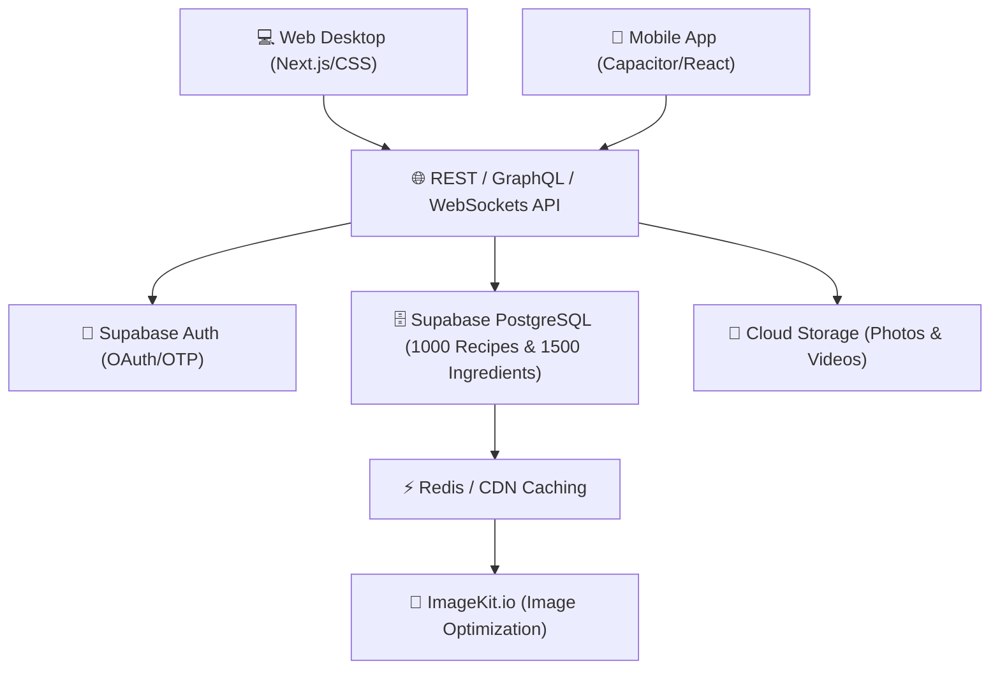

# 🍳 รายละเอียดและข้อเสนอแนะเพิ่มเติมสำหรับโครงการ N.Food (New Food)

เอกสารสเปกและแนวทางการพัฒนาโครงการ **N.Food** ฉบับปรับปรุงใหม่ โดยได้บูรณาการข้อกำหนดดิบของผู้ใช้ ร่วมกับข้อเสนอแนะเชิงลึกด้าน UI/UX, ฟีเจอร์นวัตกรรม และแนวทางสถาปัตยกรรมทางเทคนิค เพื่อปูทางสู่การสร้างแอปพลิเคชันและเว็บไซต์อาหารแห่งอนาคตที่ใช้งานได้จริงในชีวิตประจำวัน

---

## 🎨 โลโก้แบรนด์โครงการ (Project Logo Design)
เราได้ทำการออกแบบโลโก้สำหรับ **N.Food** ภายใต้แนวคิด "กึ่งอนาคตสมจริง (Futuristic-Realistic Hybrid)" เพื่อสะท้อนถึงนวัตกรรม ความพรีเมียม และความน่ารับประทาน
*   **ลิงก์ไฟล์ภาพโลโก้:** [nfood_logo.png](file:///c:/Users/User/Desktop/project%20%28%E0%B9%82%E0%B8%9B%E0%B8%A3%E0%B9%80%E0%B8%88%E0%B8%84%E0%B8%88%E0%B8%9A%29/website1/N.Food/nfood_logo.png)
*   **รายละเอียดดีไซน์:** ผสมผสานสัญลักษณ์หมวกเชฟสไตล์ล้ำยุคเข้ากับช้อนและส้อมเรืองแสงสีนีออนส้มพีชแอปริคอต ซ้อนทับการ์ดโปร่งแสงแบบกระจกฝ้า (Glassmorphic) บนพื้นผิวช็อกโกแลตเข้ม เพื่อกระตุ้นความรู้สึกหรูหรา อบอุ่น และกระตุ้นความอยากอาหารทันทีที่เห็น

---

## 🎨 มาตรฐานการออกแบบร่วม (Futuristic-Realistic Design System)
เพื่อให้หน้าตาของเว็บไซต์และแอปพลิเคชันเข้าถึงอารมณ์ **"ทันสมัยสวยงามเหมือนอยู่ในโลกอนาคต แต่ยังดูสมจริงและน่ากินเหมือนปัจจุบัน"** เราจะใช้แนวทางดังนี้:
*   **ส่วนต่อประสานกึ่งอนาคต (Futuristic Interface Features):**
    *   **Glassmorphism & Frosted Panels:** แผงควบคุม คาร์ดรายละเอียดสูตร และเมนูนำทางต่างๆ จะใช้กระจกโปร่งแสงกึ่งโปร่งใส (Frosted Glass) ที่มีความฟุ้งและมีแสงส่องสว่างจากด้านหลัง
    *   **Subtle Glowing Accents:** เส้นขอบ ปุ่มกด หรือส่วนเน้นของหน้าจอจะมีแสงเรืองรองบางเบา (Neon Glow Effects) ใช้สีโทนอุ่น เพื่อเลียนแบบหน้าจอโฮโลแกรมล้ำสมัย
    *   **Smooth Micro-interactions:** แอนิเมชันของวงล้อสุ่ม เมนูสไลด์ และการปรับจำนวนเสิร์ฟจะมีฟิสิกส์การตอบสนองที่ไหลลื่นนุ่มนวลแบบอนิเมชันสปริง (Spring Physics Animations)
*   **ความสมจริงและความน่ากิน (Realistic Food Appeal):**
    *   **High-Quality Vivid Imagery:** รูปภาพอาหารหลักในทุกหน้าจอจะต้องคมชัดระดับสูง มีการจัดแสงเงาที่สมจริงเพื่อขับเน้นความมันวาว ควันร้อน และสีสันตามธรรมชาติของผักและเนื้อสัตว์ให้สดใสเด่นชัด ไม่ใช้ภาพกราฟิกหรือ AI ที่ดูหลอกตาหรือเย็นชาเกินไป
*   **จานสี (Color Palette):**
    *   **Light Mode (เน้นความสะอาดและอบอุ่น):** สีครีมน้ำนมนุ่มนวล (`#FAF6F0`), สีขาวอุ่น (`#FFFDFB`), สีส้มพีชแอปริคอต (`#FF7A59`) และสีแดงอิฐเทอร์ราคอตตา (`#C84B31`)
    *   **Dark Mode (เน้นความล้ำสมัยและพรีเมียม):** สีช็อกโกแลตเข้มอมเทา (`#231917`) และสีทองหม่นอบอุ่น (`#E7B10A`) หลีกเลี่ยงสีดำหรือเทาเข้มแบบไอทีทั่วไปเพื่อให้โทนภาพรวมดูอบอุ่นและเป็นมิตรกับอาหาร

---

## 1. ระบบเข้าสู่ระบบและการสมัครสมาชิก (Authentication & Forgot Password)
> **เป้าหมายเดิม & ความต้องการเพิ่ม:** ล็อกอินผ่าน Google, Gmail, Line, เบอร์โทรศัพท์โดยส่งรหัส OTP มีระบบจดจำบัญชีผู้ใช้เพื่อใช้งานได้อย่างต่อเนื่อง และมีระบบแก้ไขเมื่อลืมรหัสผ่าน (Forgot Password)

### 💡 แนวทางการนำเสนอ (UI/UX Presentation)
*   **Split-Screen Layout (Desktop):** ฝั่งซ้ายแสดงวิดีโอวนลูปสั้นๆ ความละเอียดสูงของการประกอบอาหารที่ชวนให้น้ำลายสอ (เช่น ชีสยืดๆ หรือซอสมะเขือเทศเดือดปุดๆ) ฝั่งขวาเป็นกล่องฟอร์มล็อกอินกระจกฝ้าที่ลอยตัวอยู่บนพื้นหลังแบบไดนามิก
*   **Dynamic Auth Swapper:** แท็บสลับหน้าจอระหว่าง "เข้าสู่ระบบ" และ "สมัครสมาชิก" ที่เลื่อนไปมาอย่างลื่นไหลเมื่อแตะเลือก
*   **Smooth OTP Verification Screen:** ช่องสำหรับป้อนรหัส OTP 6 หลักที่มีการขยายตัวรับตัวเลขทีละช่อง และข้ามไปยังช่องถัดไปอัตโนมัติ (Auto-focus & Auto-tab) พร้อมแถบแสดงเวลานับถอยหลังวงกลมที่ค่อยๆ หดลง

### ✨ รายละเอียดฟีเจอร์เชิงลึก (Detailed Features)
*   **Multi-Channel Authentication:**
    *   **Google & Gmail Single Sign-On (SSO):** ลงทะเบียนและเข้าสู่ระบบในคลิกเดียวผ่านระบบ OAuth 2.0 ของ Google
    *   **Line Login:** รองรับการเข้าสู่ระบบผ่านแอปพลิเคชัน Line เพื่อความสะดวกสำหรับผู้ใช้งานในประเทศไทย
    *   **Phone Number with SMS OTP:** ช่องกรอกเบอร์โทรศัพท์ที่เชื่อมโยงกับผู้ให้บริการ SMS Gateway ส่งรหัส OTP 6 หลักเข้ามือถือเพื่อยืนยันตัวตนอย่างปลอดภัยภายใน 60 วินาที
*   **ระบบกู้คืนรหัสผ่าน (Forgot Password System):**
    *   เพิ่มปุ่ม **"ลืมรหัสผ่าน?"** ในหน้าฟอร์มล็อกอินหลัก
    *   เมื่อผู้ใช้แตะปุ่มนี้ ระบบจะให้เลือกกู้คืนผ่าน **Gmail/Email** (ส่งลิงก์แก้ไขรหัสผ่านแบบชั่วคราวอายุใช้งาน 15 นาทีที่ปลอดภัยสูง) หรือกู้คืนผ่าน **เบอร์โทรศัพท์** (ส่งรหัส OTP ยืนยันตัวตนใหม่เพื่อเปิดให้เปลี่ยนรหัสผ่านในแอปพลิเคชันได้ทันที)
*   **Account Lockout & Remember Me:** ระบบจดจำข้อมูลการล็อกอินในเครื่อง (Persistent Session) และการจำกัดจำนวนครั้งการเดารหัสเพื่อความปลอดภัยจากการโจมตีภายนอก

---

## 2. ความหลากหลายของเมนูอาหาร (ประเทศไทย & นานาชาติ)
> **เป้าหมายเดิม & ความต้องการเพิ่ม:** รวบรวมเมนูอาหารคาวและหวานที่มีความหลากหลายทั้งในประเทศไทยและนานาชาติอย่างครอบคลุม

### 💡 แนวทางการนำเสนอ (UI/UX Presentation)
*   **Futuristic Cuisine Carousel:** สไลเดอร์แนวนอนที่รวมธงชาติและสัญลักษณ์อาหารตัวแทนในรูปแบบการ์ดสามมิติ เมื่อเลื่อนพอยน์เตอร์ชี้ไปที่ประเทศ การ์ดจะขยายตัวและแสดงภาพอาหารหลักขึ้นชื่อด้านหลังพร้อมแสงนีออนเรืองสีอ่อนโยน
*   **Interactive Virtual Globe:** แผนที่โลกจำลองแบบลายเส้นมินิมอลอุ่นๆ ที่ให้ผู้ใช้สามารถหมุนสปินหรือแตะตามทวีปต่างๆ (เช่น ยุโรป, เอเชีย, อเมริกาเหนือ) เพื่อสุ่มหรือคัดกรองเมนูอาหารท้องถิ่นในเขตนั้นๆ

### ✨ รายละเอียดฟีเจอร์เชิงลึก (Detailed Features)
*   **Cuisine Structure:**
    *   **อาหารไทยหลากหลายภูมิภาค:** คัดสรรสูตรอาหารท้องถิ่นยอดนิยมจากภาคกลาง, ภาคเหนือ, ภาคใต้ และภาคอีสาน รวมถึงเมนูอาหารไทยชาววังและสตรีทฟู้ด
    *   **อาหารนานาชาติสากล:** ครอบคลุมเมนูเด่นจากเอเชีย (ญี่ปุ่น, เกาหลี, จีน, อินเดีย), ยุโรปและตะวันตก (อิตาลี, ฝรั่งเศส, อเมริกา) และตะวันออกกลาง
*   **Lifestyle & Health Filtering:** ระบบคัดแยกเมนูเพื่อสุขภาพ เช่น คีโต (Keto), มังสวิรัติ (Vegetarian), วีแกน (Vegan), ปลอดกลูเตน (Gluten-Free) หรืออาหารปราศจากถั่วและนมสำหรับคนแพ้ง่าย

---

## 3. ข้อมูลวัตถุดิบและวิธีทำที่สมบูรณ์
> **เป้าหมายเดิม & ความต้องการเพิ่ม:** บอกข้อมูลวัตถุดิบ ปริมาณ สัดส่วน และอธิบายวิธีทำทุกขั้นตอนอย่างครบถ้วนและสมบูรณ์ในทุกเมนู

### 💡 แนวทางการนำเสนอ (UI/UX Presentation)
*   **Interactive Prep Checklists:** รายการวัตถุดิบที่ผู้เตรียมอาหารสามารถแตะติ๊กถูกเพื่อขีดฆ่าวัตถุดิบทีละชิ้นที่เตรียมเสร็จแล้ว ช่วยให้การทำครัวไม่สับสน
*   **Cooking Mode Layout (Wizard UI):** หน้าจอเฉพาะกิจเมื่อเริ่มทำครัว ตัวอักษรจะขยายใหญ่ขึ้นเพื่อให้อ่านได้ในระยะห่าง 1 เมตร โดยหน้าจอจะแบ่งครึ่ง:
    *   **ฝั่งซ้าย:** รายการวัตถุดิบและปริมาณที่ต้องใช้เฉพาะในขั้นตอนนั้นๆ
    *   **ฝั่งขวา:** รายละเอียดขั้นตอนและคำอธิบาย พร้อมวิดีโอวนลูปสั้นแบบความชัดสูงแสดงเทคนิค (เช่น วิธีการสับ การทอด หรือระดับสีของซอสที่สุกพอดี)

### ✨ รายละเอียดฟีเจอร์เชิงลึก (Detailed Features)
*   **Built-in Step Timers:** หากในขั้นตอนนั้นระบุให้เคี่ยว 15 นาที หรืออบ 30 นาที จะมีปุ่มนาฬิกาจับเวลาฝังอยู่ทันที เมื่อกดเริ่ม ตัวจับเวลาจะนับถอยหลังพร้อมเสียงเตือนที่นุ่มนวลและไม่รบกวนสมาธิ
*   **Hands-Free Voice Assistant:** ระบบวิเคราะห์คำสั่งเสียงโดยไม่ต้องใช้อินเทอร์เน็ตผ่านเว็บเบราว์เซอร์ ผู้ใช้สามารถออกคำสั่งเสียงว่า "ถัดไป" (Next) "ย้อนกลับ" (Back) หรือ "อ่านซ้ำ" (Repeat) เพื่อเลื่อนขั้นตอนวิธีทำขณะที่มือเลอะไขมันหรือเปียกน้ำได้ทันที
*   **Alternative Ingredient Suggestions:** หากมีวัตถุดิบที่หายากในท้องถิ่น จะมีเมนูป๊อปอัปย่อยแนะแนวทางเลือกใช้วัตถุดิบทดแทนได้ (เช่น ใช้ใบกะเพราไทยแทนโหระพาอิตาเลียน หรือชี้เป้าร้านค้าจำหน่ายวัตถุดิบนำเข้าหลัก)

---

## 4. ระบบค้นหาเมนูอาหารและวัตถุดิบ
> **เป้าหมายเดิม & ความต้องการเพิ่ม:** ค้นหาเมนูอาหารและวัตถุดิบต่างๆ ได้รวดเร็ว ตรงความต้องการและยืดหยุ่น

### 💡 แนวทางการนำเสนอ (UI/UX Presentation)
*   **Glassmorphic Omnibar Search:** แถบค้นหาหลักที่ลอยตัวอยู่ด้านบนสุดของทุกหน้าจอ รองรับระบบพิมพ์ค้นหาความเร็วสูง (Instant Fuzzy Search) แสดงภาพอาหารขนาดเล็กและหมวดหมู่ทันทีในระหว่างการพิมพ์ตัวอักษรแรก
*   **Interactive Fridge Dashboard ("มีอะไรในตู้เย็นบ้าง"):** หน้าแดชบอร์ดจำลองรูปตู้เย็นล้ำอนาคต ผู้ใช้สามารถลากและวางหรือคลิกเลือกวัตถุดิบที่มีอยู่ในตู้เย็นจริงใส่เข้าไป จากนั้นระบบจะจับคู่สูตรอาหารที่เหมาะสม

### ✨ รายละเอียดฟีเจอร์เชิงลึก (Detailed Features)
*   **Match Scoring Engine:** คำนวณเป็นเปอร์เซ็นต์ความเข้ากันของเมนูตามวัตถุดิบที่มี:
    *   **สามารถทำได้ทันที (100% Match):** เมนูที่ใช้วัตถุดิบเท่าที่มีอยู่ในตู้เย็นจำลองของผู้ใช้งาน
    *   **ขาดวัตถุดิบบางส่วน (Missing 1-2 items):** เมนูที่สามารถทำได้แต่ขาดส่วนผสมเล็กน้อย พร้อมแสดงปุ่มให้แตะเพิ่มส่วนผสมที่ขาดลงใน **"รายการสินค้าที่ต้องซื้อ (Shopping List)"** ได้อัตโนมัติ
*   **Advanced Nutri-Filtering:** ฟิลเตอร์ระบุเพดานแคลอรี หรือตัวช่วยเลือกวัตถุดิบที่อยากเลี่ยง (เช่น ไม่เอาอาหารที่มีอาหารทะเล หรือเน้นเฉพาะปลา)

---

## 5. จำนวนเมนูและระบบคลังวัตถุดิบเริ่มต้น
> **เป้าหมายเดิม & ความต้องการเพิ่ม:** อาหารคาว 500 เมนู อาหารหวาน 500 เมนู (รวม 1,000 เมนู) และฐานข้อมูลคลังวัตถุดิบเริ่มต้นมากกว่า 1,500 ชนิด

### 💡 แนวทางการนำเสนอ (UI/UX Presentation)
*   **Vast Media Catalog:** หน้าเว็บแค็ตดาวน์ที่จัดเก็บเมนู 1,000 สูตรนี้ ถูกจัดการอย่างเป็นสัดส่วนด้วยการกรองแบ่งแท็บระหว่าง "อาหารคาว" และ "อาหารหวาน" อย่างละ 500 เมนู ด้วยดีไซน์หรูหรา และโหลดเร็วแบบไร้รอยต่อโดยใช้เทคนิค Infinite Scroll / Lazy Loading
*   **Collectible Ingredient Wiki:** สารานุกรมคลังวัตถุดิบ 1,500 ชนิดที่แสดงรายละเอียดของวัตถุดิบแต่ละประเภทในรูปการ์ดข้อมูลสะสมที่สวยงาม บอกข้อมูลคุณค่าโภชนาการต่อ 100 กรัม ประโยชน์ สารก่อภูมิแพ้ และอายุการเก็บรักษา

### ✨ รายละเอียดฟีเจอร์เชิงลึก (Detailed Features)
*   **Relational PostgreSQL Schema (Supabase):** 
    *   การเชื่อมต่อระหว่างเมนูอาหาร 1,000 รายการ กับวัตถุดิบ 1,500 ชนิด จะใช้ตารางเชื่อมโยงความสัมพันธ์ (Join Table) เช่น `recipe_ingredients` เพื่อระบุปริมาณที่แน่นอนและคำนวณแคลอรีจากตารางวัตถุดิบหลักได้อย่างแม่นยำและไม่ซ้ำซ้อน
*   **Seeding & Content Strategy:** การนำเข้ารายการอาหาร 1,000 เมนูและวัตถุดิบ 1,500 ชนิดจะทำผ่านสคริปต์ JSON Seeder และทำการดึงข้อมูลโภชนาการมาตรฐานของไทยและสากลเพื่อให้ข้อมูลสมบูรณ์แบบเรียลไทม์

---

## 6. ระบบคำนวณแคลอรีและโภชนาการแบบ Real-time (1 - 1,000,000 จาน)
> **เป้าหมายเดิม & ความต้องการเพิ่ม:** คำนวณแคลอรีและคุณค่าโภชนาการจากวัตถุดิบและส่วนผสมแต่ละอย่างแบบเรียลไทม์ โดยปริมาณส่วนผสมและแคลอรีจะปรับขึ้นลงทันทีตามการเพิ่ม-ลดเสิร์ฟ ตั้งแต่ 1 ถึง 1,000,000 จาน

### 💡 แนวทางการนำเสนอ (UI/UX Presentation)
*   **Fluid Slider & Numeric Input:** แถบสไลเดอร์เรืองแสงที่ผู้ใช้สามารถลากสเกล หรือคลิกกรอกตัวเลขโดยตรงเพื่อคำนวณสัดส่วนได้ตั้งแต่ 1 จาน ไปจนถึง 1,000,000 จาน (สำหรับงานเลี้ยงขนาดมหึมาหรือการผลิตเชิงอุตสาหกรรม)
*   **Vivid Servings Animation:** การขยับเปลี่ยนขนาดภาพกราฟิกจานอาหารหรือกองวัตถุดิบตามจำนวนจานที่ตั้งค่า พร้อมตัวเลขอัปเดตที่เคลื่อนไหวอย่างราบรื่น (Rolling Numbers)
*   **Macro-Nutrition Ring Charts:** วงแหวนโภชนาการ (คาร์บ, โปรตีน, ไขมัน, โซเดียม) ที่ยืดหดสัดส่วนตามจำนวนเสิร์ฟ

### ✨ รายละเอียดฟีเจอร์เชิงลึก (Detailed Features)
*   **Calculations Logic:**
    *   คำนวณปริมาณสารอาหารแต่ละวัตถุดิบผ่าน Client-side Script เพื่อความรวดเร็วโดยใช้สมการ:
        $$\text{ปริมาณวัตถุดิบในจานรวม} = \text{ปริมาณฐานของส่วนผสมนั้นๆ ต่อ 1 เสิร์ฟ} \times \text{จำนวนจานเสิร์ฟ}$$
    *   $$\text{แคลอรีรวม} = \sum (\text{แคลอรีต่อหน่วยของส่วนผสม} \times \text{ปริมาณวัตถุดิบ})$$
*   **ระบบหักลบคลังวัตถุดิบอัตโนมัติ (Inventory Auto-deduction):**
    *   เมื่อผู้ใช้แตะปุ่ม **"ยืนยันการปรุงอาหาร"** สำหรับจำนวนเสิร์ฟที่ระบุ ระบบจะนำปริมาณวัตถุดิบที่คำนวณแล้วไปทำการหักออกจากปริมาณวัตถุดิบใน "ตู้เย็นเสมือนจริง" ของผู้ใช้งานโดยอัตโนมัติ ช่วยเตือนให้ผู้ใช้งานรู้ว่าวัตถุดิบใดที่ใช้จนหมดและต้องซื้อเพิ่มในรอบถัดไป

---

## 7. กิจกรรมวงล้อสุ่ม (สุ่มอาหาร & สุ่มวัตถุดิบ)
> **เป้าหมายเดิม & ความต้องการเพิ่ม:** กิจกรรมหมุนวงล้อสุ่มที่มี 2 แบบ ได้แก่:
> 1. หมุนวงล้อสุ่มอาหาร: มีรูปภาพอาหารประกอบอยู่ในแต่ละช่องของวงล้อ มีปุ่มแยกหมวดหมู่สุ่มที่ต้องการ
> 2. หมุนวงล้อสุ่มวัตถุดิบ: สุ่มเพื่อหาไอเดียสร้างเมนูใหม่ๆ
> วงล้อต้องดีไซน์สวยงามล้ำอนาคต หมุนได้เรื่อยๆ ไม่มีล็อกผลในทันที และมีปุ่มยืนยันหรือยกเลิกหลังการสุ่มเสร็จสิ้น

### 💡 แนวทางการนำเสนอ (UI/UX Presentation)
*   **Interactive 3D Neon Wheel:** พัฒนาวงล้อสุ่มด้วย HTML5 Canvas หรือ WebGL มีฟิสิกส์แรงหมุนสมจริง มีเสียงคลิกถี่ๆ ตามความเร็วการหมุน และการสั่นเบาๆ (Haptic Feedback) บนสมาร์ทโฟน
*   **Visual Food Slices:** แต่ละส่วนของวงล้อสุ่มอาหารจะแสดงรูปเมนูอาหารจริงย่อส่วน (Mini-thumbnail) และชื่ออาหาร เมื่อสปินหยุด การ์ดผลลัพธ์สามมิติจะลอยขึ้นมาพร้อมเอฟเฟกต์ควันโชยน่ารับประทาน
*   **Category Filter Menu:** แผงปุ่มเหนือวงล้อสำหรับเลือกกรองประเภทก่อนสปิน เช่น "สุ่มเฉพาะอาหารหวาน", "สุ่มเฉพาะอาหารคาว", "สุ่มอาหารไทยรสแซ่บ" หรือ "สุ่มเมนูเส้นอินเตอร์"

### ✨ รายละเอียดฟีเจอร์เชิงลึก (Detailed Features)
*   **Action Overlay Buttons:**
    *   **ปุ่มยืนยันสิทธิ์ (Confirm & Cook):** นำผู้ใช้ไปยังหน้าวิธีทำและคำนวณโภชนาการสำหรับอาหารจานที่สุ่มได้ทันที
    *   **ปุ่มยกเลิก/สุ่มใหม่ (Respin / Cancel):** ปิดหน้าต่างการ์ดสรุปและช่วยให้ผู้ใช้สปินหมุนใหม่ได้ทันทีโดยไม่มีหน้าต่างโฆษณาหรือระบบขัดจังหวะการใช้งาน
*   **Ingredient Roulette (สุ่มวัตถุดิบหาไอเดีย):**
    *   วงล้อสุ่มวัตถุดิบที่จะช่วยสุ่มหาวัตถุดิบหลัก 1-3 ชนิด (เช่น หมูกรอบ + ไข่เค็ม) เพื่อท้าทายฝีมือทำอาหารของผู้ใช้ พร้อมแนะแนวทางสูตรอาหารที่มีอยู่ 1,000 เมนูที่มีวัตถุดิบเหล่านั้นเป็นหลัก

---

## 8. กิจกรรมโซเชียลมีเดียและระบบแชร์สูตรอาหารโดยผู้ใช้งาน (UGC & Social)
> **เป้าหมายเดิม & ความต้องการเพิ่ม:** ผู้ใช้สามารถโพสต์สูตร โพสต์รูปภาพและวิดีโออาหารที่ทำลงเว็บไซต์ได้, มีการแจ้งเตือนแบบเรียลไทม์เมื่อมีคนมากดไลก์และคอมเมนต์, สามารถกดไลก์และคอมเมนต์ได้, และแชร์เชื่อมต่อไปยังโซเชียลหลัก (Facebook, Instagram, TikTok, Twitter/X, Line) ได้แบบบูรณาการร่วมกันทั้งหมด

### 💡 แนวทางการนำเสนอ (UI/UX Presentation)
*   **Pinterest-style Masonry Grid:** หน้าฟีดคอมมูนิตี้ที่จัดวางการ์ดโพสต์รูปภาพและวิดีโออาหารจากผู้ใช้งานอย่างสวยงามไร้รอยต่อ สกรอลล์ดูผลงานได้ไม่มีสิ้นสุด
*   **Short-Video Player:** เครื่องเล่นวิดีโอแนวตั้งในตัวแอปพลิเคชันที่สามารถปัดนิ้วเพื่อรับชมคลิปสั้นวิธีทำอาหารสไตล์อินฟลูเอนเซอร์ในครัวบ้าน
*   **Heart & Sparkle Pop Animations:** แอนิเมชันหัวใจพุ่งกระจายอย่างน่ารักเมื่อกดถูกใจ (Like)

### ✨ รายละเอียดฟีเจอร์เชิงลึก (Detailed Features)
*   **Real-time Push Notifications:** แถบการแจ้งเตือนสด (Real-time WebSockets / Supabase Realtime) แจ้งเตือนเชฟผู้โพสต์สูตรทันทีเมื่อโพสต์ของตนได้รับความสนใจ คอมเมนต์ หรือการแชร์ พร้อมไอคอนแจ้งเตือนเรืองแสง
*   **Comprehensive Social Sharing Integration:**
    *   แชร์การ์ดสูตรอาหารดีไซน์มินิมอลอบอุ่นลง **Line Group** หรือ **Facebook Feed**
    *   สร้างลิงก์สำหรับนำทางผู้ใช้นอกแอปพลิเคชันให้สามารถเปิดดูสูตรอาหารบน N.Food ได้ทันทีโดยไม่ต้องเข้าสู่ระบบก่อน
    *   ปุ่มดาวน์โหลดรูปภาพสูตรอาหารสำเร็จรูปพร้อมคิวอาร์โค้ดสไตล์อินสตาแกรมการ์ดสำหรับการโพสต์ลง **Instagram Stories** หรือ **TikTok Video backgrounds**
*   **Admin Content Moderation Workflow:** แดชบอร์ดคัดกรองรูปภาพและวิดีโอจากหลังบ้านเพื่อความปลอดภัยของคอมมูนิตี้และป้องกันเนื้อหาที่ไม่เหมาะสม

---

## 9. การรองรับหน้าจอและการแยกเวอร์ชัน (Responsive Layout & Persistent State)
> **เป้าหมายเดิม & ความต้องการเพิ่ม:** รองรับหน้าจอทุกขนาดทุกอุปกรณ์ แยกระหว่างเวอร์ชันคอมพิวเตอร์ (Desktop) และมือถือ (Mobile) อย่างชัดเจน หน้าตาสวยงามสอดคล้องกัน และจำลองประวัติใช้งานล่าสุดผ่านเบราว์เซอร์

### 💡 แนวทางการนำเสนอ (UI/UX Presentation)
*   **Adaptive App Shells:**
    *   **เวอร์ชันมือถือ (Mobile Native Shell):** เน้นสไตล์แอปพลิเคชันมือถือ จัดการนำทางด้วยแถบด้านล่าง (Bottom Navigation Bar) สะดวกต่อการใช้หน้าจอมือเดียว พร้อมปุ่มวงกลมเรืองแสงโดดเด่นตรงกลางสำหรับระบบสุ่มวงล้อหรือกล้องสแกน
    *   **เวอร์ชันคอมพิวเตอร์ (Desktop Web Shell):** นำเสนอในสไตล์กว้างขวาง จัดวางองค์ประกอบเป็นแบบ Multi-column พร้อมเมนูนำทางหลักทางซ้ายมือ (Sticky Sidebar) ที่เป็นแผงกระจกฝ้าหรูหรา และมีเอฟเฟกต์โฮเวอร์การ์ดที่ยืดหยุ่น
*   **Responsive Breakpoints:** การปรับเปลี่ยนรูปแบบแสดงผลตั้งแต่ขนาดหน้าจอขนาดเล็ก 320px ไปจนถึงระดับหน้าจอใหญ่ 4K Ultra Wide

### ✨ รายละเอียดฟีเจอร์เชิงลึก (Detailed Features)
*   **State & Session Persistence:** บันทึกหน้าจอที่ผู้ใช้กำลังดูค้างไว้ ข้อมูลการสเกลวัตถุดิบล่าสุด หรือจำนวนส่วนผสมในตู้เย็นจำลองลงใน `localStorage` และ `sessionStorage` เพื่อให้ผู้ใช้สามารถปิดแท็บเว็บ เปิดแอปพลิเคชัน หรือเปลี่ยนไปหน้าจออื่นแล้วสามารถกลับมาทำอาหารขั้นตอนเดิมต่อได้โดยไม่มีข้อมูลสูญหาย

---

## 10. เทคโนโลยีที่เหมาะสมและการพัฒนาจริง (Tech Stack & App Platform)
> **เป้าหมายเดิม & ความต้องการเพิ่ม:** การวางสถาปัตยกรรมระบบเพื่อให้พัฒนาเว็บไซต์และแอปพลิเคชันที่ใช้งานได้จริง มีฟังก์ชันการทำงานเหมือนกันทุกประการ และบำรุงรักษาง่ายในระยะยาว

### ⚙️ สถาปัตยกรรมระบบที่แนะนำ (System Architecture)

### 💡 รายละเอียดทางเทคนิคของแต่ละส่วน (Technical Details)
*   **Frontend Framework:**
    *   **Next.js (React.js):** ใช้สำหรับการเรนเดอร์หน้าเว็บฝั่งเซิร์ฟเวอร์ (Server-Side Rendering - SSR) ช่วยให้โหลดเนื้อหาอาหารที่เน้นภาพถ่ายได้อย่างรวดเร็วมาก ได้เปรียบด้าน SEO ค้นหาเจอใน Google และมี CSS Modules/Vanilla CSS สำหรับปรับแต่งหน้าตาพรีเมียมล้ำยุค
*   **Hybrid Mobile App Converter:**
    *   **Capacitor.js:** เครื่องมือในการ Wrap เว็บไซต์สไตล์ Responsive ของเราให้รันเป็นแอปพลิเคชันดั้งเดิม (Native App) ทั้งบน Android และ iOS ทำให้เขียนโค้ดชุดเดียวแต่รันฟังก์ชันและได้ UI/UX ที่เหมือนกัน 100% บนทุกแพลตฟอร์ม สะดวกต่อการขึ้น App Store และ Play Store
*   **Backend & Serverless Services (Supabase Stack):**
    *   **Supabase Database (PostgreSQL):** ระบบฐานข้อมูลมาตรฐานอุตสาหกรรม รองรับทรานแซกชันขนาดใหญ่สำหรับการจับคู่คำนวณแคลอรี
    *   **Supabase Auth:** รองรับการรวมกลุ่มผู้ใช้ผ่านบัญชี Google, Line และระบบยืนยัน SMS OTP แบบบิวท์อิน
    *   **Supabase Realtime:** รับส่งข้อมูลผ่าน WebSockets เพื่อแจ้งเตือนการไลก์และคอมเมนต์แบบทันท่วงที
    *   **Supabase Storage:** สำหรับเก็บรักษาและเรียกดูไฟล์ภาพนิ่งและวิดีโอสั้นอาหารของผู้ใช้งานที่มีจำนวนมากได้อย่างยืดหยุ่น
*   **CDN Image & Video Optimization:** ใช้ **ImageKit.io** หรือ **Cloudinary** เพื่อทำหน้าที่ปรับขนาด ครอบตัด และบีบอัดรูปภาพและวิดีโออาหารของผู้ใช้โดยอัตโนมัติก่อนส่งถึงเบราว์เซอร์ เพื่อให้โหลดเสร็จสิ้นภายในเวลาน้อยกว่า 1 วินาที แม้จะเป็นการสกรอลล์ในหน้าคอมมูนิตี้ก็ตาม

###  ระบบสมาชิก เข้าสู่ระบบ และตั้งค่า (Auth, Profile & Settings System)

#### หน้าต่างเข้าสู่ระบบ & สมัครสมาชิก (Login & Register Modal)
* **หน้าเข้าสู่ระบบ (Login):**
  * ช่องกรอก: **อีเมล หรือ เบอร์โทรศัพท์** และ **รหัสผ่าน (Password)**
  * ปุ่มข้อความ: **"ลืมรหัสผ่าน?" (Forgot Password?)**
  * ปุ่มกด: **"เข้าสู่ระบบ"** | **"-- OR --"** | ปุ่ม: **"เข้าสู่ระบบด้วย Google"**
* **หน้าสมัครใช้งาน (Register):**
  * ช่องกรอกครบเซ็ต: **อีเมล หรือ เบอร์โทรศัพท์**, **ชื่อที่แสดง (Display Name)**, **ชื่อ (First Name)**, **นามสกุล (Last Name)**, **อายุ (Age)**, **รหัสผ่าน**, **ยืนยันรหัสผ่าน**
  * ช่องติ๊กเลือก: **☑️ "Remember my Password"**
  * ปุ่มกด: **"สมัครใช้งาน"** | **"-- OR --"** | ปุ่ม: **"สมัครใช้งานด้วย Google"**

#### ระบบลืมรหัสผ่านและยืนยัน OTP (Forgot Password & OTP Flow)
* **ขั้นตอนที่ 1:** กรอก **อีเมล หรือ เบอร์โทรศัพท์** + ตัวเลือกการรับรหัส (OTP SMS/Email หรือ ลิงก์รีเซ็ต)
* **ขั้นตอนที่ 2:** หน้ากรอกรหัส **OTP 6 หลัก** พร้อมตัวนับถอยหลังส่งใหม่ (60 วินาที)
* **ขั้นตอนที่ 3:** หน้าตั้ง **รหัสผ่านใหม่ (New Password)** และยืนยันรหัสผ่าน พร้อม Password Strength Indicator
* รองรับการเชื่อมต่อฝั่ง Backend ด้วย **Supabase Auth API** (`resetPasswordForEmail`, `verifyOtp`, `updateUser`)